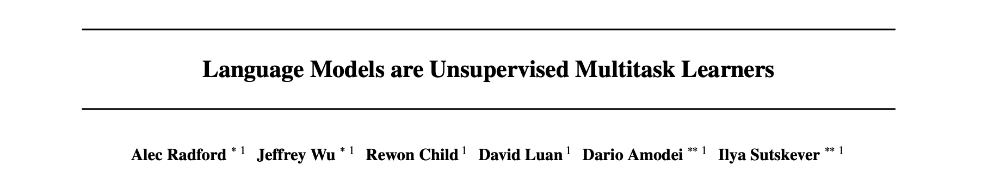

## GPT-2.0

- 论文：Language Models are Unsupervised Multitask Learners
- 地址：https://d4mucfpksywv.cloudfront.net/better-language-models/language-models.pdf
- 源码：https://github.com/openai/gpt-2

> Due to our concerns about malicious applications of the technology, we are not releasing the trained model.

上面那句话就是引发“CloseAI风波”的罪魁祸首了，当时各种社交网站媒体的讨论可谓是舌剑唇枪、枪林弹雨、雨覆云翻、翻脸不认人啊。还好后面OpenAI说会一阶段一阶段慢慢开源更大的模型（目前官方release的是117M和345M的模型）

> 虽然官方没有放出最大模型的源码，但是有一个外国小哥好像已经完成了对GPT-2的复现
>
> - [GPT2, Counting Consciousness and the Curious Hacker](https://medium.com/@NPCollapse/gpt2-counting-consciousness-and-the-curious-hacker-323c6639a3a8)
> - [github](https://github.com/ConnorJL/GPT2)

预训练模型增强的另一方面是数据增强，GPT-2就是很好的一个实例。GPT-1是首先使用Transformer作为预训练模型的，在各项任务上的提升也都非常亮眼（图片来自张俊林老师）

> 我翻开历史一查，这历史没有年代，歪歪斜斜的每页上都写着 **‘Multitask Learners’** 几个字。我横竖睡不着，仔细看了半夜，才从字缝里看出字来，满本都写着两个字是 **‘general LM’**！” -------鲁迅评GPT-2

相较于GPT-1，GPT-2大体的框架都没有变（单向Transformer+LM），主要是在以下几个方面进行了修改：

- **数据：** 更大规模更高质量的数据，800万网页40GB的 WebText；
- **模型**： 虽然Transformer没变，但是却更大了，从24层叠加到了48层（15亿参数）
- **训练方式**：抛弃了有监督的fine-tune下游任务，只采用无监督语言模型训练直接应用下游任务。
- **其他细节**：输入采用了BPE（在之前PART II中也有介绍）；Layer norm放到了每个sub-block前并在最后一个self-attention block之后添加了额外一个LN层；残差层的参数初始化根据网络深度进行调节；扩大了词表/输入序列长度/批大小。

以上每一点修改都在强调GPT-2的 **‘general’**（鲁迅老师说得对），作者认为一个强大的预训练模型可以不需要有监督数据去训练甚至不需要下游任务的微调即可直接使用。而无监督的语言模型自然是完成该任务的最好选择，只要预训练数据足够general，模型设计足够general，那么语言模型自然能学习到输入语料的所有信息，最后的结果必然是general的。

那么，既然GPT-2抛弃了之前针对特定任务的fine-tune模式，我们知道各项任务的目的不一样，仅仅凭借语言模型学习到的GPT-2又是如何来实现的呢？为了让模型意识到它是在完成什么任务，作者对不同的任务设置了不同的pattern：

- **Reading Comprehension**：`document` + `history of associated conversation` + `A：`
- **Summarization**：`article` + `TL;DR:`
- **Translation**：类似于词向量的类比， `en sent = fr sent + target en sent`做条件生成
- **Question Answering**：同翻译类似

ok，咱们来看看模型的效果，这就非常有意思了。机器翻译和阅读理解，文中给出的分数BLEU 11.5/F1 55，这都比当时的SOTA（33.5/89）要低很多，读到这你可能要黑人问号了，但是别急，看GPT-2气呼呼的解释："他们那些SOTA的状元都是刷五年高考三年模拟的，我平时都不学习看看杂书也能上二本啊！" 再次黑人问号....

emmmmmm， 仔细想想倒也没错，术业有专攻嘛。okay，看了那么多七七八八的书，那你讲故事一定很厉害吧？GPT-2反手就是一篇高考英语大作文，怕了怕了...

### reference

- [Better Language Models and Their Implications](https://openai.com/blog/better-language-models/#task6)
- [效果惊人的GPT 2.0模型：它告诉了我们什么](https://zhuanlan.zhihu.com/p/56865533)
- [NLP的bert和后bert时代的挑战](https://zhuanlan.zhihu.com/p/66676144)
- [如何评价openAI GPT-2?](https://www.zhihu.com/question/312405015)
- [官方源码](https://github.com/openai/gpt-2)

