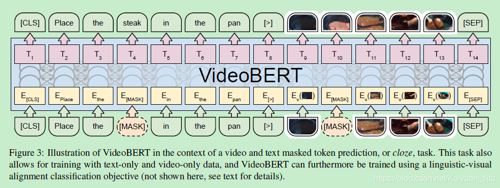

## Video-BERT

- 论文：VideoBERT: A Joint Model for Video and Language Representation Learning
- 地址：https://arxiv.org/pdf/1904.01766.pdf
- 源码：NULL

最后这篇，只能说成功看饿我了，还没看过的建议大家搭配炸鸡啤酒食用效果更佳。

我们在生活中通过感知得到的信息是多源的（视觉，听觉，味觉等），基于此，一个成熟的机器学习模型也应该是趋近与人类的这种多源学习的----多模态机器学习（Multimodal Machine Learning）。目前比较成熟的视觉和语义之间的多模态学习，比如看图说话等等。作者在本文中就提出 VideoBERT，利用 BERT 去联合学习视频与语言之间的信息。

- **文本数据**： 来自 Youtube 提供的 ASR 工具，自动语音书别获得文本，作为 BERT 输入的上半部分；
- **视频数据**： 用 vector quantization (VQ) 获取视频特征。具体是首先利用预训练 S3D 网络得到 1024 维的特征向量，接着通过层次聚类将这些特征进行分类（类似于 tokenize），然后将每一个 segment 作为BERT输入的下半部分；

整体框架如下所示，注意几个特殊标记：**[CLS]** 代表文本和视频的全局信息，后续任务中用到； **[>]** 代表文本和视频输入的区分；**[SEP]** 在 BERT 中代表句子区分与结束，但这里好像只有做结束标记用。  

训练过程分为三项：

- **text-only：**  mask后进行预测的训练方式
- **video-only：**  同上
- **video-text：**  linguistic-visual 对齐任务，使用 [CLS] 标记去预测文本与视频是否是对应的，分类问题。

后面实验的面包披萨蛋糕洋葱圈啊就不馋大家了~

###  Reference	

- [BERT fintune 的艺术](https://zhuanlan.zhihu.com/p/62642374)

