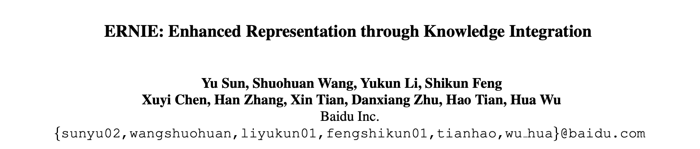
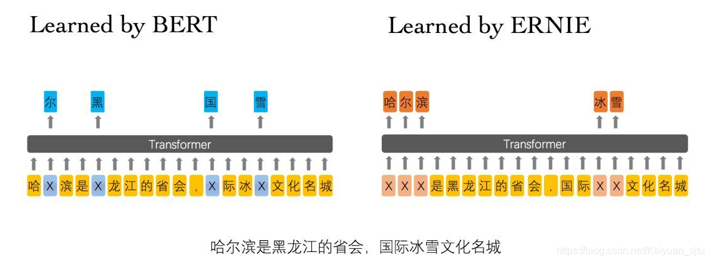
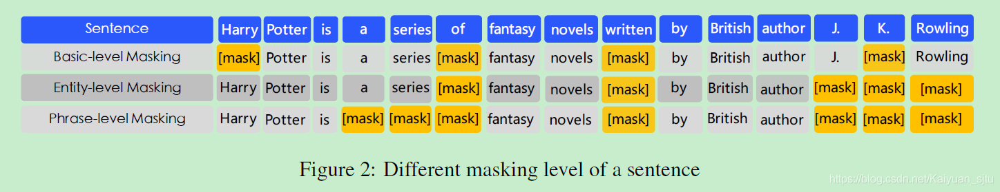

- 论文：ERNIE: Enhanced Representation through Knowledge Integration
- 地址：https://arxiv.org/pdf/1904.09223.pdf
- 源码： https://github.com/PaddlePaddle/models/blob/release/1.8/PaddleNLP/shared_modules/models/representation/ernie.py

百度提出的 ERNIE 模型主要是针对 BERT 在中文 NLP 任务中表现不够好提出的改进。我们知道，对于中文，bert 使用的基于字的处理，在 mask 时掩盖的也仅仅是一个单字，举个栗子：

> 我在上海交通大学玩泥巴-------> 我 在 上 【mask】 交 通 【mask】学 玩 【mask】 巴。

作者们认为通过这种方式学习到的模型能很简单地推测出字搭配，但是并不会学习到短语或者实体的语义信息， 比如上述中的【上海交通大学】。于是文章提出一种知识集成的BERT 模型，别称 ERNIE。ERNIE 模型在 BERT 的基础上，加入了海量语料中的实体、短语等先验语义知识，建模真实世界的语义关系。

在具体模型的构建上，也是使用的 Transformer 作为特征抽取器。这里如果对于特征抽取不是很熟悉的同学，强烈推荐张俊林老师的"[放弃幻想，全面拥抱Transformer：自然语言处理三大特征抽取器（CNN/RNN/TF）比较](https://zhuanlan.zhihu.com/p/54743941)"。

那么怎么样才能使得模型学习到文本中蕴含的潜在知识呢？不是直接将知识向量直接丢进模型，而是在训练时将短语、实体等先验知识进行 mask，强迫模型对其进行建模，学习它们的语义表示。  

具体来说， ERNIE 采用三种 masking 策略：

- **Basic-Level Masking：** 跟bert一样对单字进行 mask，很难学习到高层次的语义信息；
- **Phrase-Level Masking：** 输入仍然是单字级别的，mask 连续短语；
- **Entity-Level Masking：** 首先进行实体识别，然后将识别出的实体进行 mask。

经过上述 mask 训练后，短语信息就会融入到 word embedding 中了。

此外，为了更好地建模真实世界的语义关系，ERNIE预训练的语料引入了多源数据知识，包括了中文维基百科，百度百科，百度新闻和百度贴吧（可用于对话训练）。

关于论文后面的试验就不再赘述。

**reference：**

- [如何评价百度新发布的NLP预训练模型ERNIE？](https://www.zhihu.com/question/316140575)
- [中文任务全面超越 BERT：百度正式发布NLP预训练模型ERNIE](https://www.jiqizhixin.com/articles/2019-03-16-3)
- [官方源码](https://github.com/PaddlePaddle/LARK/tree/develop/ERNIE)