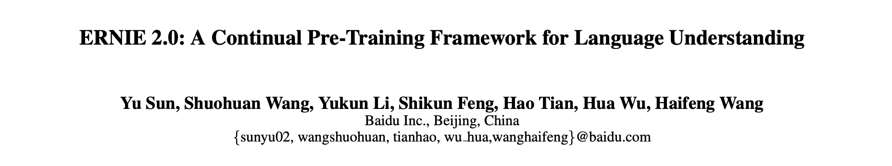
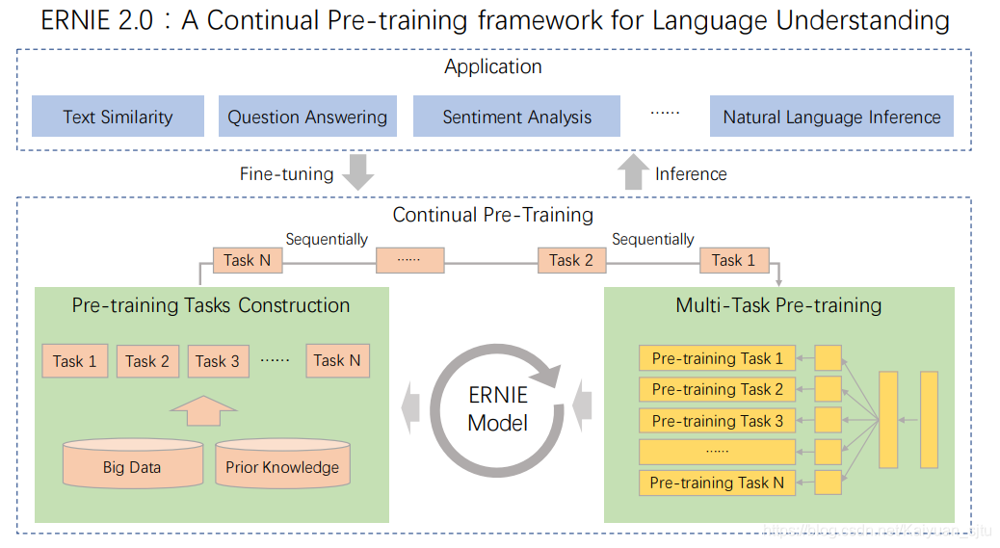
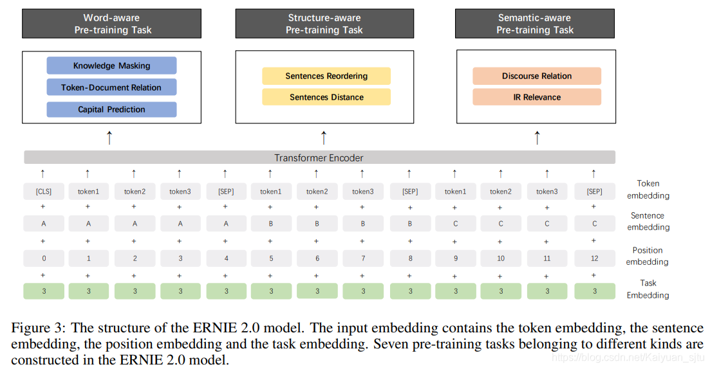
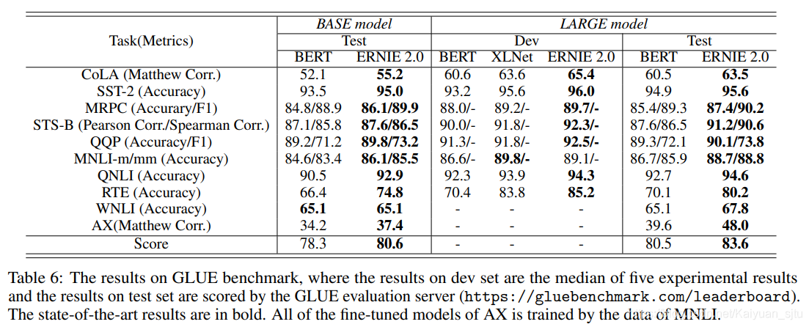
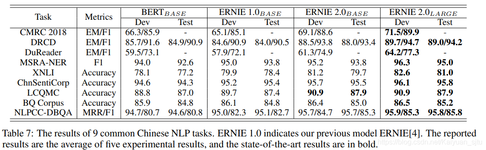

- 论文：ERNIE 2.0: A Continual Pre-training Framework for Language Understanding
- 地址：https://arxiv.org/abs/1907.12412
- 源码：[https://github.com/PaddlePaddle/ERNIE](https://github.com/PaddlePaddle/ERNIE.)

国产模型 **ERNIE2.0**。Baidu 团队之前发布的 ERNIE1.0 效果就不错，虽然基础框架沿袭BERT，但是训练语料以及 mask 策略的改进，使其在中文任务上表现更好。这刚过了几个月，又发布了增强版的 ERNIE，最近 NLP 社区更新速度可见一斑。 

先前的模型比如 ELMO、GPT、BERT、ERNIE1.0、XLNet 等都是基于词和句子的共现关系来训练的，这导致模型不能够很好地建模词法、句法以及语义信息。为此，ERNIE2.0提 出了**通过不断增量预训练任务进行多任务学习**来将词法句法以及语义信息融入到模型当中去。

整体流程如下所示，首先利用简单的任务初始化模型，接着以串行的方式进行**持续学习（Continual Learning）**，对于每次新增的训练任务，模型可以利用之前已经训练过的任务信息去更好地学习新任务，这跟人类的学习方式是一样的。

**模型框架**

整体框架还是基本跟 ERNIE1.0 的一样，不过 ERNIE2.0 为了匹配多任务持续学习的理念，需要在输入的时候额外增加一部分 **Task Embedding**，用来告诉模型这是在处理哪个任务。 

**预训练任务**

前面说到要让模型获取词法、句法以及语义的信息，那么怎么设计合适的预训练任务就成了非常重要的一环。其实 BERT 本身也可以看做是多任务（MLM+NSP），然后对于扩展BERT 至多任务，MTDNN 也有过尝试，使用了 GLUE 相似的任务进行训练然后在 GLUE 上 SOTA 了。

不过 ERNIE2.0 与 MTDNN 在任务设计上不同的是，在预训练阶段使用的任务基本都是无监督或者是弱监督的。要知道在 NLP 中有标注的数据不多，但是无标注的数据可以说是源源不断，如果能好好利用起来简直功德圆满。okay，下面我们来介绍一下具体的任务设计。

**Word-aware Pre-training Tasks**

基于单词的预训练任务用于获取词法信息

- **Knowledge Masking Task：** 就是 ERNIE1.0 使用的预训练任务，将实体与短语进行 mask，具体可以[参考站在BERT肩膀上的NLP新秀们（PART I）](https://blog.csdn.net/Kaiyuan_sjtu/article/details/90757442)

- **Capitalization Prediction Task：** 预测单词是否大写。因为在语料中大写字词通常具有特殊含义

- **Token-Document Relation Prediction Task ：** 预测某一个段落的 token 是否出现在同一篇文档的另外段落中。可以认为是对关键字进行建模

**Structure-aware Pre-training Tasks**

主要是用于建模句法信息

- **Sentence Reordering Task：** 具体而言是把一段话拆分成多个 segment，之后对其进行排列组合，让模型去预测正确的原始顺序。感觉有点像高中英语试卷大作文前面的那一题 hhh...

- **Sentence Distance Task：** 预测句子之间的距离，可以看做是三分类的任务，其中 “0” 表示两个句子是同一篇文档中相邻的，“1” 表示两个句子在同一篇文档中但是不相邻，“2” 表示两个句子不在同一个文档中。这个任务的话可以看做是 BERT 的 NSP 任务的扩展版

**Semantic-aware Pre-training Tasks**

主要用于建模语法信息

- **Discourse Relation Task：** 预测两个句子之间的语义或修辞关系。

- **IR Relevance Task ：** 学习信息检索中短文本的相关性。百度作为搜索引擎的优势就是有大量的**query**和**answer**可以用于模型训练。这也是一个三分类的任务，输入为 `query+title`，输出为标签，其中“0”表示这两个是强相关的（定义为用户点击的结果条目），“1”表示弱相关（定义为搜索返回结果中不被用户点击的条目），“2”表示不相关（定义为没有出现在返回结果里的条目）

**模型效果**

okay，介绍完模型，我们来看看效果怎么样~ERNIE2.0 以及 BERT 在 GLUE 上的表现，可以看出在所有任务上 ERNIE2.0 的效果都超过了原始的 BERT 和 XLNet。但是有一点就是我去 [GLUE Leadboard ](https://gluebenchmark.com/leaderboard/)上瞄了一眼，好像并没有看到 ERNIE2.0 的身影，不知道为什么还没有提交上去？

这是中文数据集上的模型比对效果，目前中文版的模型好像还没有发布出来~

**reference**

[官方开源代码](https://github.com/PaddlePaddle/ERNIE)

[如何评价百度最新发布的ERNIE2.0？](https://www.zhihu.com/question/337827682)

[ERNIE 2.0：芝麻街 2.0？](https://zhuanlan.zhihu.com/p/76125042)

[百度ERNIE 2.0强势发布！16项中英文任务表现超越BERT和XLNet](https://mp.weixin.qq.com/s?__biz=MzUxNzk5MTU3OQ==&mid=2247485569&idx=1&sn=52dc7e15cf2eaa9bfba9d1eb406c7f13&chksm=f98ef575cef97c63a385277de520ccb7b3fe97a897ef1b000eddb59ff4ab5ccedbed64666a84&mpshare=1&scene=1&srcid=&sharer_sharetime=1565503331327&sharer_shareid=7dd731b7b37b3e66efe906001d207d0f&key=6401b985c78d5340794bef994a357fe9beca490681474aaa242bf6aa7c86acff9ca3c0476667c082d55f0f26d7bf42173076be569d3b4d0e202ba41a69128575008cef7358ce9c6a212b48fd68bc3974&ascene=1&uin=MTA1NDIwMzgyMQ==&devicetype=Windows 10&version=62060833&lang=zh_CN&pass_ticket=jnp8Sj8xwvQyqpSgMt4iiUhNpFW7HS4eZG7XDDSyx8RqSXCH1mdeZ2wYDjCiqeD9)

