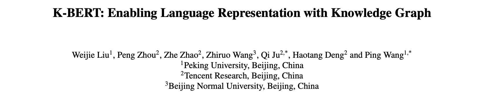
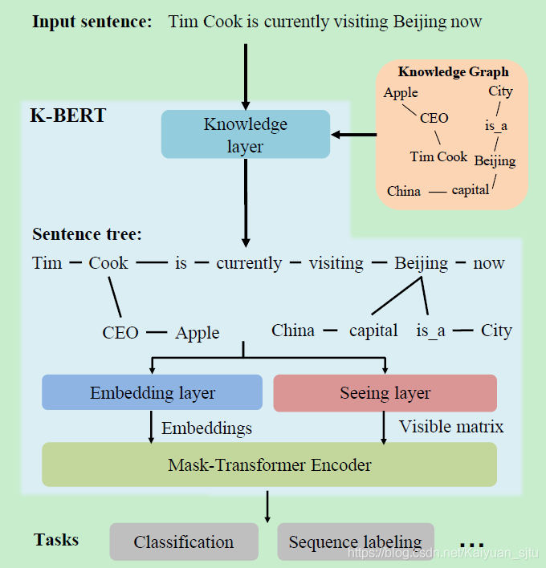
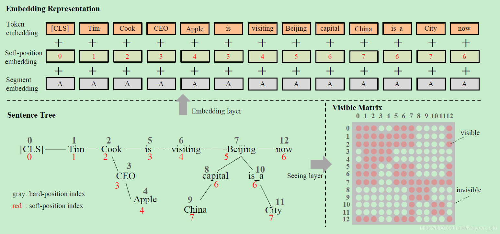
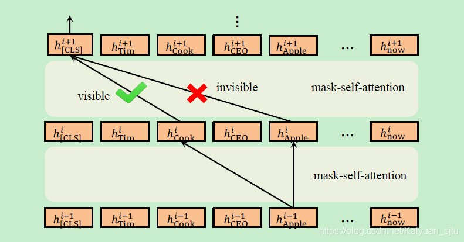

- 论文：K-BERT: Enabling Language Representation with Knowledge Graph
- 地址：https://arxiv.org/pdf/1909.07606.pdf
- 源码：https://github.com/autoliuweijie/K-BERT

作者指出通过公开语料训练的 BERT 模型仅仅是获得了 general knowledge，就像是一个普通人，当面对特定领域的情境时（如医疗、金融等），往往表现不如意，即 **domain discrepancy between pre-training and fine-tuning**。而本文提出的 **K-BERT** 则像是领域专家，通过将知识库中的结构化信息（三元组）融入到预训练模型中，可以更好地解决领域相关任务。如何将外部知识整合到模型中成了一个关键点，这一步通常存在两个难点：

- **Heterogeneous Embedding Space：** 即文本的单词 embedding 和知识库的实体实体 embedding 通常是通过不同方式获取的，使得他俩的向量空间不一致；
- **Knowledge Noise：** 即过多的知识融合可能会使原始句子偏离正确的本意，过犹不及。

Okay，理解了大致思想之后我们来分析具体的实现方式。模型的整体框架如下图，主要包括了四个子模块： **knowledge layer**, **embedding layer**, **seeing layer** 和 **mask-transformer**。

对于一个给定的输入 $s=({w_{0}, w_{1}, w_{2}, \dots, w_{n}})$ ，首先 **knowledge layer** 会从一个 KG 中注入相关的三元组，将原来的句子转换成一个 knowledge-rich 的句子树；接着句子树被同时送入 **embedding layer** 和 **seeing layer** 生成一个 token 级别的 embedding 表示和一个可见矩阵（visible matrix）；最后通过 **mask-transformer** 层编码后用于下游任务的输出。

## Knowledge Layer

这一层的输入是原始句子 $s={w_{0}, w_{1}, w_{2}, \dots, w_{n}}$ ，输出是融入 KG 信息后的句子树
$$
t = {w_{0}, w_{1}, \ldots, w_{i}\{{\left(r_{i 0}, w_{i 0}\right), \ldots,\left(r_{i k}, w_{i k}\right)}\}, \ldots, w_{n}}
$$

通过两步完成：

- **K-Query**  输入句子中涉及的所有实体都被选中，并查询它们在 KG 中对应的三元组 EEE ；
- **K-Inject** 将查询到的三元组注入到句子 sss 中，将 EEE 中的三元组插入到它们相应的位置，并生成一个句子树 ttt 。

## Embedding Layer

K-BERT 的输入和原始 BERT 的输入形式是一样的，都需要 token embedding, position embedding 和 segment embedding，不同的是，K-BERT 的输入是一个句子树，因此问题就变成了句子树到序列化句子的转化，并同时保留结构化信息。

**Token embedding**

句子树的序列化，作者提出一种简单的重排策略：**分支中的 token 被插入到相应节点之后，而后续的 token 被向后移动**。举个栗子，对于上图中的句子树，则重排后变成了`Tim Cook CEO Apple is visiting Beijing capital China is a City now`。没错，这的确看上去毫无逻辑，但是还好后面可以通过 trick 来解决。

**Soft-position embedding**

通过重排后的句子显然是毫无意义的，这里利用了 position embedding 来还原回结构信息。还是以上图为例，重排后，`CEO`和`Apple` 被插入在了`Cook`和`is`之间，但是`is`应该是接在`Cook`之后一个位置的，那么我们直接把`is`的 position number 设置为 3 即可。Segment embedding 部分同 BERT 一样。

## Seeing Layer

作者认为 Seeing layer 的 mask matrix 是 K-BERT 有效的关键，主要解决了前面提到的 **Knowledge Noise** 问题。栗子中`China`仅仅修饰的是`Beijing`，和`Apple`半毛钱关系没有，因此像这种 token 之间就不应该有相互影响。为此定义一个可见矩阵，判断句子中的单词之间是否彼此影响
$$
M_{i j}=\left\{\begin{array}{cc}
0 & w_{i} \ominus w_{j} \\
-\infty & w_{i} \oslash w_{j}
\end{array}\right.
$$

## Mask-Transformer

BERT 中的 Transformer Encoder 不能接受上述可见矩阵作为输入，因此需要稍作改进。Mask-Transformer 是一层层 mask-self-attention 的堆叠，
$$
{ Q ^ { i + 1 } , K ^ { i + 1 } , V ^ { i + 1 } = h ^ { i } W_ { q } , h ^ { i } W_ { k } , h ^ { i } W_ { v } } \ { S ^ { i + 1 } = \operatorname { softmax } \left( \frac { Q ^ { i + 1 } K ^ { i + 1 } + M } { \sqrt { d_  { k } } } \right) } \ { h ^ { i + 1 } = S ^ { i + 1 } V ^ { i + 1 } }
$$

