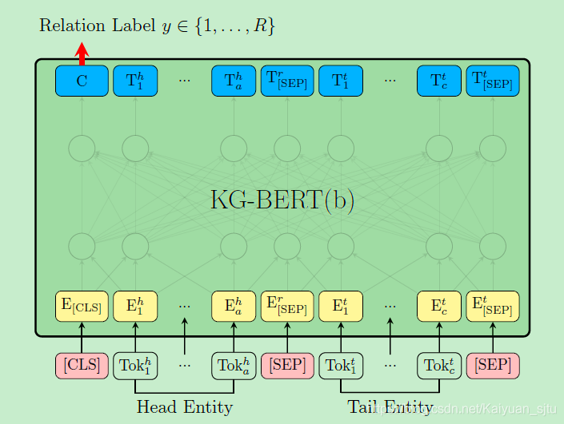

## KG-BERT

- 论文：KG-BERT: BERT for Knowledge Graph Completion
- 地址：https://arxiv.org/abs/1909.03193
- 源码：https://github.com/yao8839836/kg-bert

这篇文章是介绍知识库补全方面的工作，结合预训练模型 BERT 可以将更丰富的上下文表示结合进模型中，在三元组分类、链接预测以及关系预测等任务中达到了 SOTA 效果。

具体的做法也非常简单易懂，就是修改了 BERT 模型的输入使其适用于知识库三元组的形式。  

首先是 **KG-BERT(a)**，输入为三元组 $(h, r, t)$ 的形式，当然还有 BERT 自带的 special tokens。举个栗子，

对于三元组 $(Steve Jobs, founded, Apple Inc)$，上图中的`Head Entity`输入可以表示为`Steven Paul Jobs was an American business magnate, entrepreneur and investor`或者`Steve Jobs`，而`Tail Entity`可以表示为`Apple Inc. is an American multinational technology company headquartered in Cupertino, California`或`Apple Inc`。

也就是说，头尾实体的输入可以是**实体描述**句子或者**实体名**本身。 模型训练是首先分别构建 **positive triple set** 和 **negative triple set**，然后用 BERT 的 [CLS] 标签做一个 sigmoid 打分以及最后交叉熵损失
$$
{L}=-\sum{\tau \in \mathbb{D}+\cup \mathbb{D}^{-}}\left(y{\tau} \log \left(s{\tau 0}\right)+\left(1-y{\tau}\right) \log \left(s_{\tau 1}\right)\right)
$$

上述的 **KG-BERT(a)** 需要输入关系，对于关系分类任务不适用，于是作者又提出一种 **KG-BERT(b)**，如上图。这里只是把 sigmoid 的二分类改成了 softmax 的关系多分类。
$$
\mathcal{L}^{\prime}=-\sum{\tau \in \mathbb{D}^{+}} \sum{i=1}^{R} y{\tau i}^{\prime} \log \left(s{\tau i}^{\prime}\right)
$$
有一点想法，既然已经训练了那么多的三元组信息，按理说模型应该是会有学到外部知识的一些信息，也算是一种知识融合，是不是可以把这个模型经过三元组训练后用来做一做其他的 NLU 任务看看效果？

