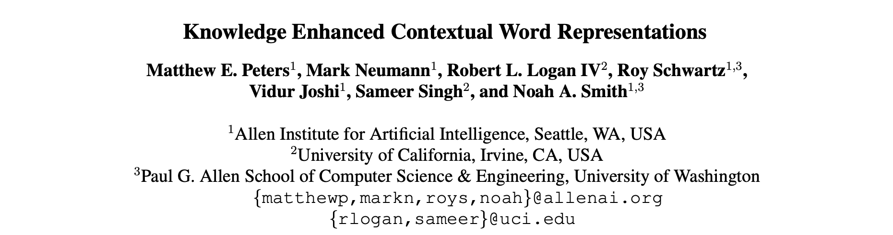
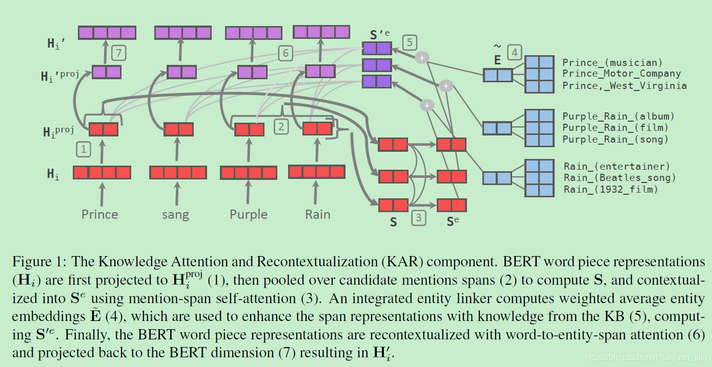
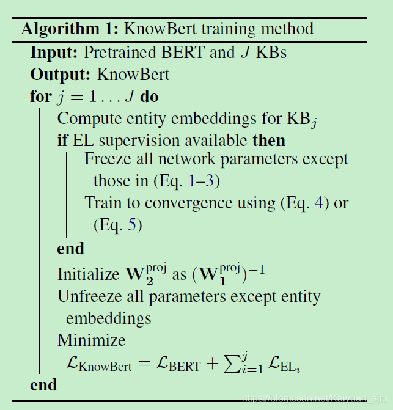

## KnowBERT

- 论文：Knowledge Enhanced Contextual Word Representations
- 地址：https://arxiv.org/abs/1909.04164
- 源码：NULL

**KnowBERT** 重点也是在如何将知识库里的结构化信息融入大规模预训练模型中去，主要是通过 **Knowledge Attention and Recontextualization component （KAR）** 实现的。论文中关于BERT模型和知识库的介绍这里就不再啰嗦，直奔主题看看 KAR 到底是怎样的。

这里的 KAR 设计成了一个可插拔式的轻量级的层，这也是文章的亮点之一，可以直接应用在 BERT 之类的模型上不改变模型的使用方式。**KAR** 的输入是某一层出来的向量表示 $H_{i}$ ，输出是知识增强后的向量表示 ${ H } _{ i } ^ { \prime }=KAR(H_{i}, \mathbf{C})$，之后再送入模型的下一层 $H_{i+1} = TransformerBlock(\mathbf { H } _ { i } ^ { \prime })$。整个 KAR 的框架如上图所示，主要由四个关键模块组成。

### Mention-span representations

首先输入 $H_{i}$  通过线性映射到 entity dimension 
$$
H_i^{proj}=H_iW_1^{proj}+b_1^{proj}
$$
然后使用 self-attentive span pooling 操作对每个 span 得到一个表示 $s_{m}$ ，最后堆叠成一个矩阵 $S$ 。这一步对应上图中的【1】和【2】

### Entity linker

Entity linker 负责对可用候选中的每个潜在提及进行实体歧义消除。具体操作也是一个 self-attention，这使得KnowBert 可以考虑全局信息进行 link decision，以便它可以充分利用实 实体-实体的共现，并可以解决哪几个重叠的候选提及应该被链接。

$$
S^{e}=TransformerBlock(S)
$$

$S_{e}$ 用于对每个候选实体进行打分，并从知识库中合并候选实体。每个候选域 mmm 都有相对应的向量表示 $s_{m}^{e}$ 、 $M_{m}$ 个候选实体（向量表示 $e_{mk}$ ）以及先验概率 $p_{ml}$ ，利用 2 层的 MLP 可以计算出得分：

$$
\psi_{m k}=\operatorname{MLP}\left(p_{m k}, \mathbf{s}_{m}^{e} \cdot \mathbf{e}_{m k}\right)
$$

### Knowledge enhanced entity-span representations

这一步就是将直属库实体的信息融入到模型当中，准确地说是实体的表示，是通过向量运算的形式。对每一个span $m$，将分数低于设定阈值 $\delta$ 的候选实体都忽略，大于的那些再通过 softmax 进行归一化：
$$
\tilde{\psi}_{m k}=\left\{\begin{array}{ll}
\frac{\exp \left(\psi_{m k}\right)}{\sum_{\psi_{m k} \geq \delta} \exp \left(\psi_{m k}\right)}, & \psi_{m k} \geq \delta \\
0, & \psi_{m k}<\delta
\end{array}\right.
$$
加权得到实体 embedding：

$$
\tilde{\mathbf{e}}_{m}=\sum_{k} \tilde{\psi}_{m k} \mathbf{e}_{m k} \mathbf{s}_{m}^{\prime e}=\mathbf{s}_{m}^{e}+\tilde{\mathbf{e}}_{m}
$$

### Recontextualization

主要是通过 attention 操作将前面融入了外部知识的实体表示整合进所有 token 的表示，这里 query 是 ${H}_{i}^{\mathrm{proj}}$，key 和 value 都是上一步得到的 ${S}^{\prime e}$

$$
H_i^{′proj}=MLP(MultiHeadAtn(H_i^{proj},S^{′e},S^{′e}))
$$
最后前面也提到了 KnowBERT 知识属于一个可插拔式的中间层，不会改变原始 BERT 模型的维度这些，所以要对齐回去
$$
\mathbf{H}_{i}^{\prime}=\mathbf{H}_{i}^{\prime p 0 \mathbf{j}} \mathbf{W}_{2}^{\mathrm{proj}}+\mathbf{b}_{2}^{\mathrm{proj}}+\mathbf{H}_{i}
$$
后面好像是对实体进行加权来进行知识增强，看的有点乱...留坑等看懂了再来补

### 训练

