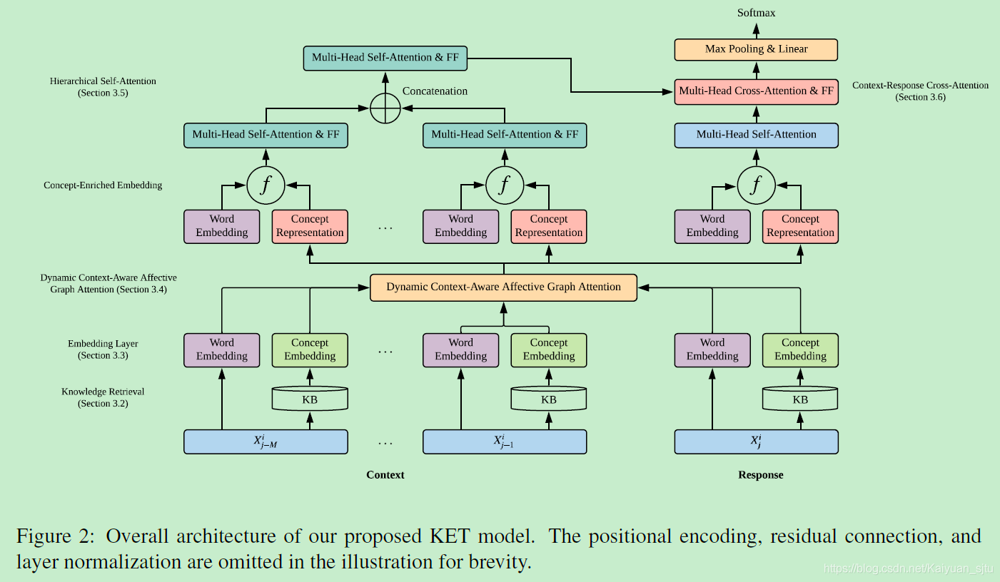

- 论文：Knowledge-Enriched Transformer for Emotion Detection in Textual Conversations
- 地址：https://arxiv.org/abs/1909.10681
- 源码：https://github.com/zhongpeixiang/KET

这篇是将外部常识知识用于特定的任务，在对话中的情绪识别问题，提出一种 **Knowledge- Enriched Transformer (KET)**  框架，如下图。关于 Transformer、情绪识别等背景知识不做复杂介绍，主要看看是如何将外部知识应用起来的。

## 任务概览

首先来看一下任务，给定对话数据集，数据格式为 $\{X_{j}^{i} , Y_{j}^{i}\}$， $X_{ j } ^ { i }$ 表示第 $i$ 组对话第 $j$ 句表述，$Y_{ j } ^ { i }$ 表示第 $i$ 组对话第 $j$ 句表述对应的标签，目标是最大化
$$
\Phi = \prod _ { i = 1 } ^ { N } \prod _ { j = 1 } ^ { N _ { i } } p \left( Y _ { j } ^ { i } | X _ { j } ^ { i } , X _ { j - 1 } ^ { i } , \ldots , X _ { 1 } ^ { i } ; \theta \right)
$$

## Knowledge Retrieval

模型使用了常识知识库 **ConceptNet** 和情感词典 **NEC_VAD** 作为外部知识来源，对于对话中的每个非停用词 token，都会从 ConceptNet 检索包含其直接邻居的连通知识图 $g(t)$，并且对对于每一个 $g(t)$，会移除停用词、词表外词以及置信分数低于 1 的 concept。经过上述操作，最终得到的，对于每一个 token，都会有 a list of tuples:
$$
\left(c{1}, s{1}, V A D\left(c{1}\right)\right),\left(c{2}, s{2}, V A D\left(c{2}\right)\right), \ldots,\left(c{|g(t)|}, s{|g(t)|}, V A D\left(c_{|g(t)|}\right)\right)
$$

## Embedding Layer

就是常见的word embedding 加上 position embedding

## Dynamic Context-Aware Affective Graph Attention

这个名字好拗口...动态上下文感知情感图注意力，目的就是计算每个 token 融入知识后的上下文表示$\mathbf{c}(t)=\sum_{k=1}^{|g(t)|} \alpha_{k} * \mathbf{c}_{\mathbf{k}}$ 其中 $c_{k}$ 表示 concept embedding，$\alpha_{k}$ 代表其对应的 attention weight $\alpha_{k}=\operatorname{softmax}\left(w_{k}\right)$ 。这里面最重要的就是 $w_{k}$ 的计算，在这个模型中假设上下文越相关且情感强度越强的 concept 越重要，即具有更高的权重。那么如何衡量呢？提出了两个因素：**相关性因子**和**情感因子**

- **相关性因子**：衡量 $c_{k}$ 和会话上下文之间关系的关联程度。
    $$
    r e l_{k}=\min -\max \left(s_{k}\right) * a b s\left(\cos \left(\mathbf{C R}\left(X^{i}\right), \mathbf{c}_{\mathbf{k}}\right)\right)
    $$
    其中 $cos(*)$ 表示余弦相似度，$CR(X^{i})$ 表示第 $i$ 组对话的上下文表示，因为一组对话中可能存在多个句子，所以就表示为所有句子的向量平均
    $$
    \mathbf{C R}\left(X^{i}\right)=\operatorname{avg}\left(\mathbf{S} \mathbf{R}\left(X_{j-M}^{i}\right), \ldots, \mathbf{S R}\left(X{j}^{i}\right)\right)
    $$

- **情感因子** ：衡量 $c_{k}$ 的情感强度
    $$
    a f f{k}=\min -\max \left(\left|\left|\left[V\left(c{k}\right)-1 / 2, A\left(c*{k}\right) / 2\right]\right|\right|_{2}\right)
    $$

将上述两个因素综合考虑可得到 $w_{k}$ 的表达式
$$
w_{k}=\lambda_{k} * r e l_{k}+\left(1-\lambda_{k}\right) * a f f_{k}
$$
最后融入知识的上下文表示可以通过一个线性转变得到最后融入知识的上下文表示可以通过一个线性转变得到最后融入知识的上下文表示可以通过一个线性转变得到
$$
\hat{\mathbf{t}}=\mathbf{W}[\mathbf{t} ; \mathbf{c}(t)]
$$

## Hierarchical Self-Attention

提出了一种层次化自注意力机制，以利用对话的结构表示形式并学习上下文话语的向量表示形式。

- 第一步，对于 utterance $X_{n}^{i}$，可以表示为：
  $$
  \hat{\mathbf{X}}_{n}^{'i}=F F\left(L^{\prime}\left(M H\left(L\left(\hat{\mathbf{X}}{n}^{i}\right), L\left(\hat{\mathbf{X}}_{n}^{i}\right), L\left(\hat{\mathbf{X}}_{n}^{i}\right)\right)\right)\right)
  $$
  
  
  其中
  $$
  M H(Q, K, V)=\operatorname{softmax}\left(\frac{Q K^{T}}{\sqrt{d_{s}}}\right) V \\
  FF(x)=max⁡(0,xW_1+b_1)W_2+b_2
  $$
  
- 第二步，利用所有对话来学习上下文表示
    $$
    C^i=FF(L′(MH(L(\hat X^i),L(\hat X^{i}),L(\hat X^i))))
    $$
    其中
    $$
    \hat{\mathbf{X}}^{i} \text { denotes }\left[\hat{\mathbf{X}}_{j-M}^{\prime i} ; \ldots ; \hat{\mathbf{X}}_{j-1}^{i}\right]
    $$

## Context-Response Cross-Attention

最后，通过前面得到的融入外部知识的上下文表示来得出预测标签。
$$
\begin{array}{l}
\mathbf{R}^{i}=F F\left(L^{\prime}\left(M H\left(L\left(\hat{\mathbf{X}}_{j}^{\prime i}\right), L\left(\mathbf{C}^{i}\right), L\left(\mathbf{C}^{i}\right)\right)\right)\right) \\
\hat{\mathbf{X}}_{j}^{\prime i}=L^{\prime}\left(M H\left(L\left(\hat{\mathbf{X}}_{j}^{i}\right), L\left(\hat{\mathbf{X}}_{j}^{i}\right), L\left(\hat{\mathbf{X}}_{j}^{i}\right)\right)\right) \mathbf{O}=\max _{-} \operatorname{pool}\left(\mathbf{R}^{i}\right) \\
p=\operatorname{softmax}\left(\mathbf{O} W_{3}+b_{3}\right)
\end{array}
$$
