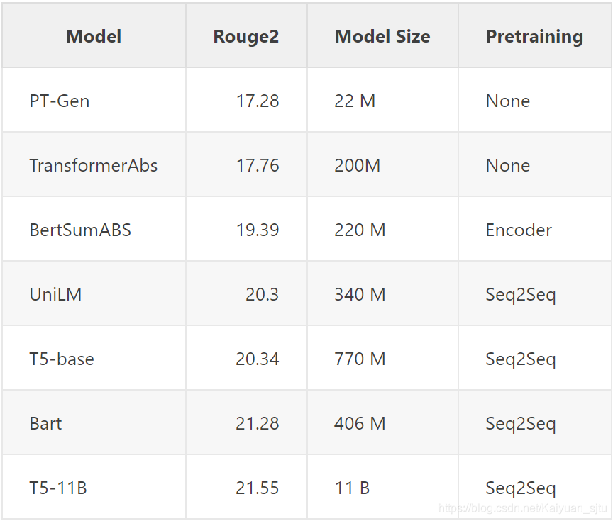

- 论文：BART: Denoising Sequence-to-Sequence Pre-training for Natural Language Generation, Translation, and Comprehension
- 地址：https://arxiv.org/pdf/1910.13461.pdf
- 源码：NULL

## 写在前面

最近 huggingface 的 transformer 库，增加了 BART 模型，Bart 是该库中最早的 Seq2Seq 模型之一，在文本生成任务，例如摘要抽取方面达到了 SOTA 的结果。


本次放出了三组不同的预训练权重：

- `bart-large`：基础预训练模型；
- `bart-large-cnn`：基础模型在 CNN/Daily Mail Abstractive Summarization Task 微调后的模型；
- `bart-large-mnli`：基础模型在 MNLI classification task 微调后的模型；

下面我们来看看 BART。

## 背景：Seq2Seq预训练

去年 10 月，来自 Google 和 Facebook 的团队分别发布了新的 Transformer-related 论文：T5 和 BART。 这两篇论文在如抽象总结和对话等生成任务上都取得了更好的下游性能，主要有两个改变：

- 在 BERT 的双向编码器架构中添加因果解码器；
- 用更复杂的预训练任务代替 BERT 的完形填空任务。

现在让我们更深入地研究 Seq2Seq 预训练思想！

**Bert vs. GPT2**

正如 BART 作者在论文中写的，

> (BART) can be seen as generalizing Bert (due to the bidirectional encoder) and GPT2 (with the left to right decoder).

**BERT**

BERT 最重要的预训练任务是预测 masked token，并使用整个输入来获取更完全的信息以进行更准确的预测。这对于那些允许利用位置 $i$ 之后的信息来预测位置 $i$ 的任务是有效的，但是对于诸如文本生成之类的任务则没有多大用处，这些对位置 $i$ 的预测只能取决于先前生成的单词。

在 BERT 源码中，在预测位置 $i$ 时可以使用哪些信息是由由一个称为`attention_mask`的参数来控制的， 注意掩码中的值为 1 表示模型在预测行的单词时可以利用的列单词的信息。

下图是 BERT 的 "Fully-visible" 注意力矩阵，


关于BERT更为详细的讲解可以参考往期文章：

- [知乎专栏：BERT巨人肩膀](https://zhuanlan.zhihu.com/c_1121788551427215360)

**GPT**

GPT 预训练任务使用的是`autoregressive`的思想，使用已经解码出的信息来预测下一个位置。该种模式对于生成任务更为有效，而对于那些可以使用全局输入来得到输出的下游任务则比较差劲。

同样的，给出 GPT 的注意力矩阵，


在这里，当我们预测`eating`时，可以使用的信息只有`<BOS> I love`。

**Encoder-Decoder**

我们的新朋友，例如BART，可以做到两全其美。

其中Encoder的注意力矩阵是`Fully-visible`的，


而Decoder的注意力矩阵是`autoregressive`,


编码器和解码器通过`cross attention`连接，其中每个解码器层都对编码器输出的最终隐藏状态进行 ttention 操作，这会使得模型生成与原始输入紧密相关的输出。

**预训练模式**

Bart 和 T5 在预训练时都将文本 span 用掩码替换， 然后让模型学着去重建原始文档。（PS.这里进行了简化， 这两篇论文都对许多不同的预训练任务进行了实验，发现这一方法表现良好。T5 使用`replace corrupted spans`任务， 没有进行 mask 操作，而是选择了随机 token 进行替换。）

BART 论文的图很好地说明了这一点：


在上述示例中，原始文档为`A B C D E`。在编码之前将文本`[C，D]`屏蔽掉，又在 B 之前插入一个额外的掩码，然后将损坏的文档`A _ B _ E`作为编码器的输入。解码器必须使用编码器的输出和先前未损坏的标记来重建原始文档。

## Summarization

在`摘要生成`任务中，输入序列是我们要总结的文档，输出序列是一段事实摘要。 Seq2Seq 架构可直接用于摘要任务，而无需任何新的操作， 并且预训练任务也非常适合下游任务。 下表中的数字证实了这一点：在 CNN / Daily Mail 抽象摘要任务中，所有新的 Seq2Seq 模型都比那些 old less-fancy 模型做得好得多，而 BART 的表现尤其出色。



`BertSumABS`来自论文《Text Summarization with Pretrained Encoders》，使用 Seq2Seq 结构，但没有对解码器进行预训练。 `TransformerAbs`来自同一篇论文，使用稍小的模型，并且也没有预训练。

`PT-Gen`来自论文《 Get To The Point: Summarization with Pointer-Generator Networks》

`UniLM`是一种 “Prefix-LM”，具有与 Bart 和 T5 相似的 masking 策略

## Demo: BartForConditionalGeneration

这一节来看看如何用几行代码就完成一个摘要抽取任务。

**Step 1**

首先安装最新版本的`transformers`和一些必要的库

```bash
!pip install transformers --upgrade
```


```python
import torch
try:
    import transformers
    from transformers import BartTokenizer, BartForConditionalGeneration
except ImportError:
    raise ImportError(INSTALL_MSG)
from IPython.display import display, Markdown
```

**Step 2**

找到一篇待抽取的长长长文本

```python
torch_device = 'cuda' if torch.cuda.is_available() else 'cpu'

LONG_BORING_TENNIS_ARTICLE = """
 Andy Murray  came close to giving himself some extra preparation time for his w
edding next week before ensuring that he still has unfinished tennis business to
 attend to. The world No 4 is into the semi-finals of the Miami Open, but not be
fore getting a scare from 21 year-old Austrian Dominic Thiem, who pushed him to 
4-4 in the second set before going down 3-6 6-4, 6-1 in an hour and three quarte
rs. Murray was awaiting the winner from the last eight match between Tomas Berdy
ch and Argentina's Juan Monaco. Prior to this tournament Thiem lost in the secon
d round of a Challenger event to soon-to-be new Brit Aljaz Bedene. Andy Murray p
umps his first after defeating Dominic Thiem to reach the Miami Open semi finals
 . Muray throws his sweatband into the crowd after completing a 3-6, 6-4, 6-1 vi
ctory in Florida . Murray shakes hands with Thiem who he described as a 'strong 
guy' after the game . And Murray has a fairly simple message for any of his fell
ow British tennis players who might be agitated about his imminent arrival into 
the home ranks: don't complain. Instead the British No 1 believes his colleagues
 should use the assimilation of the world number 83, originally from Slovenia, a
s motivation to better themselves. At present any grumbles are happening in priv
ate, and Bedene's present ineligibility for the Davis Cup team has made it less 
of an issue, although that could change if his appeal to play is allowed by the 
International Tennis Federation. Murray thinks anyone questioning the move, now 
it has become official, would be better working on getting their ranking closer 
to his. 'If he was 500 in the world they wouldn't be that fussed about it but ob
viously he threatens their position a bit,' said the 27 year-old Scot. ' and he'
s obviously the British number two, comfortably. 'So they can complain but the b
est thing to do is use it in the right way and accept it for what it is, and try
 to use it as motivation whether they agree with it or not. He's British now so 
they've just got to deal with it. Murray stretches for a return after starting h
is quarter final match slowly on the show court . Thiem held nothing back as he 
raced through the opening set, winning it 6-3 with a single break . The young Au
strian is considered to be one of the hottest prospects on the ATP Tour . 'I wou
ld hope that all the guys who are below him now like James (Ward) , Kyle (Edmund
) , Liam (Broady) they will use it as motivation. If he becomes eligible for Dav
is Cup then those guys are going to have to prove themselves. 'It can only be se
en as a positive for those guys using it to try to get better. He's a good playe
r but so are James and Kyle and Liam has improved. Aljaz is there, he's on the t
our every week, the other guys aren't quite there yet.' For the first time Murra
y, who has an encyclopaedic knowledge of the top 100, gave his opinion of Bedene
: 'He's a good player with a very good serve. He's a legitimate top 100 player, 
when he plays Challengers he's there or thereabouts, when he plays on the main t
our he wins matches, it's not like he turns up and always loses in the first rou
nd. Murray's fiancee was once again watching from the stands shaded by a huge br
immed hat . Kim Sears flashes her enormous diamond engagement ring while watchin
g her beau on court . 'He had a bad injury last year (wrist) but has recovered w
ell. I would imagine he would keep moving up the rankings although I don't know 
exactly how high he can go. I've practised with him a couple of times, I haven't
 seen him play loads, but when you serve as well as he does it helps. I would im
agine he' s going to be comfortably in the top 70 or 80 in the world for a while
.' It is understood the Lawn Tennis Association will give background support to 
his case regarding the Davis Cup but have made it clear that the onus is on him 
to lead the way. An official statement said: 'To have another player in the men'
s top 100 is clearly a positive thing for British tennis and so we very much wel
come Aljaz's change in citizenship.' The last comparable switch came twenty year
s ago when Greg Rusedski arrived from Canada. It was by no means universally pop
ular but, like Bedene, he pledged that he was in for the long haul and, in fairn
ess to him, he proved true to his word. Loising the first set shocked Murray int
o life as he raced to a commanding lead in the second . The No 3 seed sent over 
a few glaring looks towards his team before winning the second set . Murray had 
to put such matters aside as he tackled the unusually talented Thiem, a delight 
to watch. Coached by Boris Becker's veteran mentor Gunter Bresnik, he slightly r
esembles Andy Roddick and hits with similar power but more elegance. His single 
handed backhand is a thing of rare beauty. However, he has had a mediocre season
 coming into this event and there was little to forewarn of his glorious shotmak
ing that seemed to catch Murray unawares early on. The world No 4 looked to have
 worked him out in the second, but then suffered one of his periopdic mental lap
ses and let him back in from 4-1 before closing it out with a break. After break
ing him for 3-1 in the decider the Austrian whirlwind burnt itself out. 'He's a 
strong guy who hits the ball hard and it became a very physical match,' said Mur
ray. Murray was presented with a celebratory cake after winning his 500th match 
in the previous round .
""".replace('\n','')
```

**Step 3**

只需几行代码调用 transformers 库中的 BART，进行摘要生成


> BART 生成的摘要效果： Andy Murray beat Dominic Thiem 3-6, 6-4, 6-1 in the Miami Open. The world No 4 is into the semi-finals of the tournament in Florida. Murray was awaiting the winner from the last eight match between Tomas Berdych and Argentina's Juan Monaco. Thiem lost in the second round of a Challenger event to Aljaz Bedene.

再来看看 GPT 的效果，公平的说，它并不适合摘要生成的任务。 


> GPT 生成的效果： 'To have a player like James Ward, Kyle Edmund, Liam Broady and Aljaz Bedene in the top 100 is a huge achievement for the Lawn Tennis Association. The Lawn Tennis Association is committed to the development of the sport and the development of the sport's players. The Lawn Tennis Association is committed to the development of the sport and the development of the sport's players. The Lawn Tennis Association is committed to the development of the sport and the development of the sport's players. The Lawn Tennis Association is committed to the development of the sport and the development of the sport's players. The Lawn Tennis Association is committed to the development of the sport and the development of the sport's players. The Lawn Tennis Association is committed to the development of the sport and the development of the

最后，大家可以在共享的 colab 里看到上述 demo：https://colab.research.google.com/drive/11hKBPfsfBXPKo-dK_gHsPklF4PcNflQZ 或者直接去 transformers 的官方 github 库里查看。

