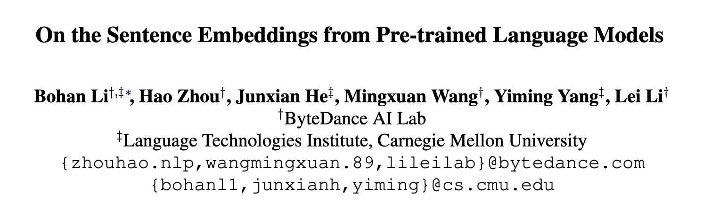
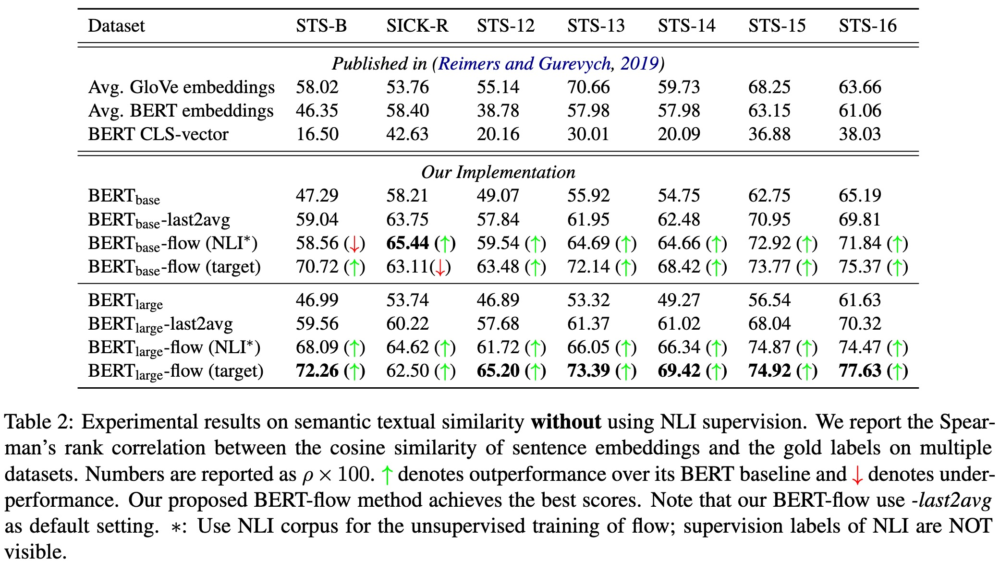
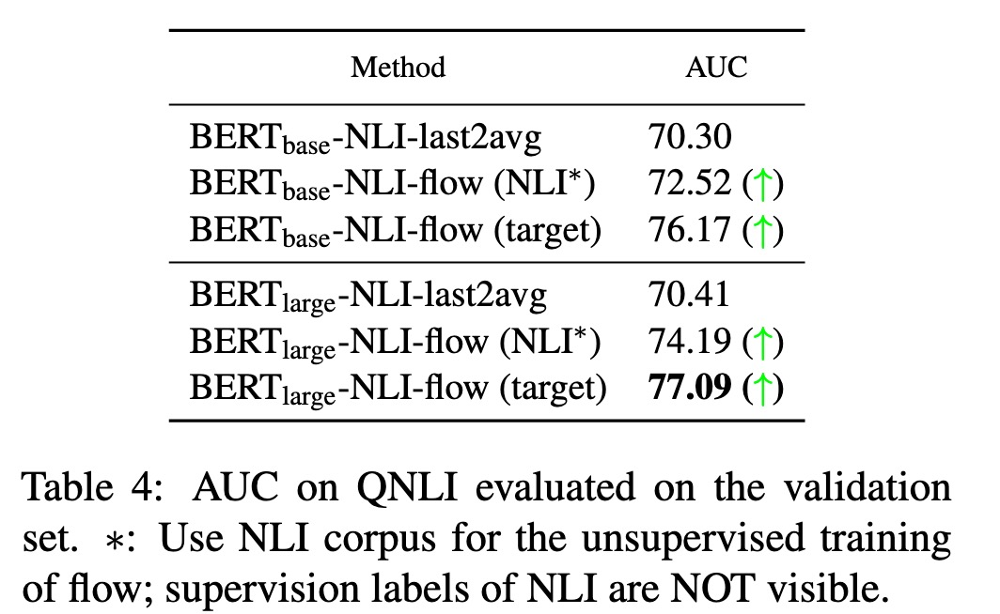
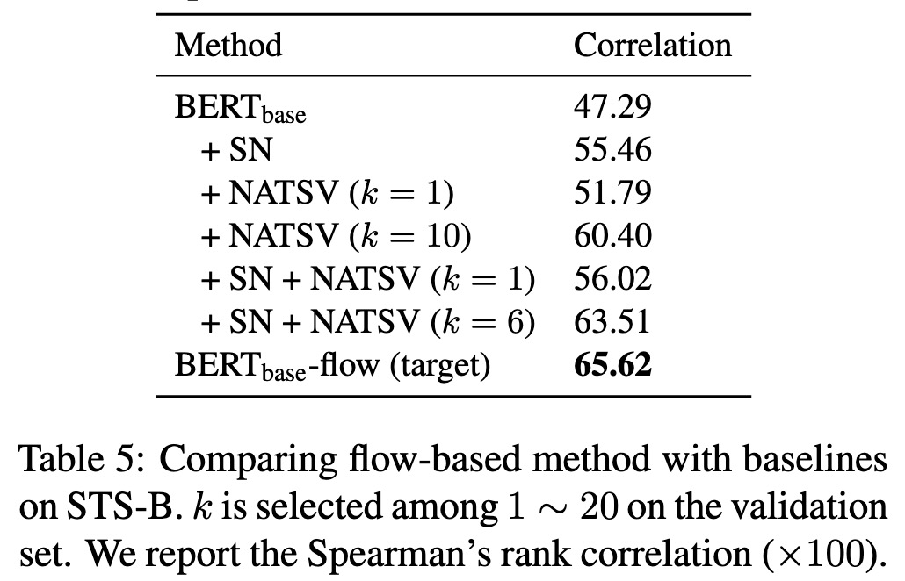
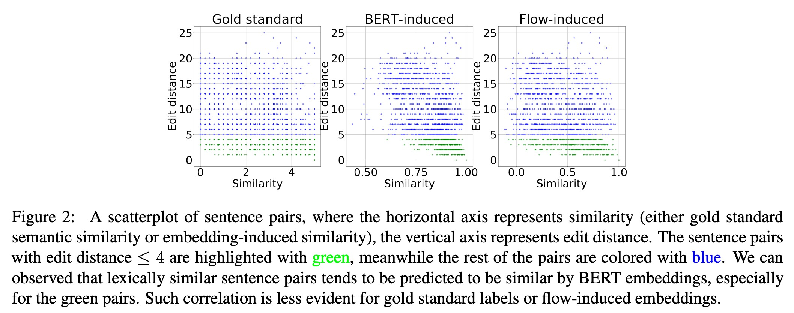

## BERT-FLOW



- 论文：On the Sentence Embeddings from Pre-trained Language Models
- 地址：https://arxiv.org/abs/2011.05864
- 源码：https://github.com/bohanli/BERT-flow


> 无监督方法将 Bert 产生的非平滑各向异性的句子语义空间分布转换为各向同性的高斯分布。

### 动机和核心问题

Bert 取得的成功毋庸置疑，但在 Sentence Embedding 方面（比如句子相似度任务）表现却很差，甚至不如 Glove。针对这个情况，本文主要回答两个问题：

- 为什么 Bert 的 Sentence Embedding 在语义相似句子任务上效果不好？是没有学习到足够的语义信息，还是仅仅因为语义信息没有被正确利用？
- 如果 Bert 学习到足够的语义信息但是很难被直接使用，有没有什么不需要额外监督训练的方法能让它变得容易些？

我们首先回顾一下如何拿到句子相似度，Bert 时代一般有两种搞法：

- 直接提取 CLS Token 的 Embedding，Naive 简单粗暴。
- 计算最后一层或多层的平均值，注意这个计算是在 Sequence Length 的维度做的，最后拿到的依然是 BatchSize × HiddenSize 维度的张量。

不过 Sentence-Bert 19 年的论文做过实验得出平均方法比直接用 CLS 的效果好，本文又发现平均最后两层效果比只平均最后一层好。代码也很简单：

```python
pooled = 0
input_mask_ = tf.cast(tf.expand_dims(input_mask, axis=-1), dtype=tf.float32)
for i in range(X):
    sequence = model.all_encoder_layers[-i] # [batch_size, seq_length, hidden_size]
    pooled += tf.reduce_sum(sequence * input_mask_, axis=1) / tf.reduce_sum(input_mask_, axis=1)
pooled /= float(X)
```

X = 1 时就是只用最后一层。

### 第一个问题：Bert 的语义相似度

Sentence Embedding 相似度可以简化为 Context Embedding 的相似度，但因为 Bert 训练过程中并没有计算两个 Embedding 的点乘（或 Cosine 相似度），所以需要（想象、假设）。

首先，根据论文《Breaking the softmax bottleneck: A high-rank rnn language model》的结论：
$$
\begin{aligned}
& h_{c}^{T} w_{x} \approx \log p^{*}(x \mid c)+\lambda_{c} \\
=& \operatorname{PMI}(x, c)+\log p(x)+\lambda_{c}(1)
\end{aligned}
$$
其中 c 是 Context，w 是 Word。而 PMI 常用来近似度量词的语义相似，所以（马马虎虎地），计算 Context Embedding 和 Word Embedding 的点乘也具有语义意义。

接下来，考虑到两个 Context 的关系可以通过他们与词的连接推断和加强。具体来说，两个不同的 Context 如果与同一个词共现，那这两个 Context 可能在语义上相似。Context 和词同时出现，Context 的 Embedding 和 Word Embedding 也应该接近。预训练时，以词表中的词为中心，Context Embedding 应该可以学习到彼此之间的语义关联。

这样，我们就可以认为 Bert 的预训练过程其实已经在 “暗中” “鼓励” 语义上有意义的上下文嵌入。也就是说，Bert 预训练其实隐含了上下文语义的训练。

### 第二个问题：各向异性 Embedding 导致语义相似度差

考虑到 Word Embedding 和 Context Embedding 在同一空间，本文用 Word Embedding 来分析。

本文通过实验计算表明 Word Embedding 受词频影响，因为词连接了上下文，所以 Context Embedding 可能被词频信息带歪，进而导致语义信息有损。本文给出了三篇参考文献，表明 autoregressive language model 都会有各向异性的问题，其中一篇文献还证明这和不均衡的词频（Zipf Rule）高度相关。

另外，低频词与相邻词的距离要比高频词远，因此低频词会导致稀疏，进而导致 Embedding 空间有很多 “hole”（洞洞？），这些区域的语义表示就不佳（因为 Sentence Embedding 是相加的到的）。洞洞会损害 Embedding 空间的凸性，这是表征学习的一个 Common 问题，本文又连续给出三篇参考，感兴趣的可以了解下。

### 解决方法：BERT-Flow

因为标准的高斯分布满足各向同性，而且不存在 “hole” 的区域，上面两个问题都能得到缓解。所以，很自然就想将它应用到这里。本文就是通过 Normalizing Flow（一个可逆网络）将 Bert 的句子嵌入分布转换为平滑的各向同性的高斯分布，具体而言，就是学习一个基于 Flow 的生成模型来最大化从一个标准高斯隐变量空间生成 Bert 句子嵌入的似然函数。训练时，只有 Flow 网络的参数被优化，Bert 的参数保持不变；学习完成后，该可逆网络就可以用来将 Bert 的句子嵌入映射到高斯空间。

这个 Normalizing flows 当然也是有参考的，不过这篇论文现在已经改名字了：《Normalizing Flows: An Introduction and Reviewof Current Methods》。另外，在代码实现上应该是参考了 OpenAI 和 Google：

- [openai/glow: Code for reproducing results in "Glow: Generative Flow with Invertible 1x1 Convolutions"](https://github.com/openai/glow)
- [tensor2tensor/tensor2tensor/models/research at master · tensorflow/tensor2tensor](https://github.com/tensorflow/tensor2tensor/tree/master/tensor2tensor/models/research)

这块内容就不在本文展开了。具体使用方法可以参考官方 GitHub：[bohanli/BERT-flow: TensorFlow implementation of On the Sentence Embeddings from Pre-trained Language Models (EMNLP 2020)](https://github.com/bohanli/BERT-flow)。

### 实验效果

先说明下，评估方法采用 Sentence Embedding 的 Cosine 相似度与标签相似度的 [Spearman 相关系数](https://www.wikiwand.com/en/Spearman's_rank_correlation_coefficient)。

- 语义相似度

    

    NLI 表示在 NLI（SNLI+MNLI）上训练 Flow，target 表示在所有数据集上训练 Flow。

- QA 任务

    

    X-NLI 表示使用 NLI 监督，这个是 Sentence-Bert 里面的方法，对比需要。这个任务本来是判断 QA 对的 Label 是 “包含” 或 “不包含”，本文用问题和答案的相似度来表示 Label（1 表示包含，0 表示不包含）。

- 其他 Embedding

    

    其中，SN 表示标准归一化，即对 Sentence Embedding Z 标准化。NATSV 表示 Nulling Away Top-k Singular Vectors，即通过使顶部的奇异向量无效，可以避免嵌入的各向异性，并可以实现更好的语义相似性。

- 词汇相似度

    

    词汇相似度用编辑距离衡量，然后看两个相似度的相关性。标准相关性为 -24.61，Bert 的是 -50.49，Bert-Flow 的论文没说。论文觉得，很多时候改变一个字都有可能会完全影响语义，但是 Bert 因为相关性强，所以改变一个或少数几个（主要是编辑距离小于等于 4 的情况）字，语义可能改变很小。

### 相关资料

- [[1908.10084\] Sentence-BERT: Sentence Embeddings using Siamese BERT-Networks](https://arxiv.org/abs/1908.10084)
- [[1908.09257\] Normalizing Flows: An Introduction and Review of Current Methods](https://arxiv.org/abs/1908.09257)
- [openai/glow: Code for reproducing results in "Glow: Generative Flow with Invertible 1x1 Convolutions"](https://github.com/openai/glow)
- [tensor2tensor/tensor2tensor/models/research at master · tensorflow/tensor2tensor](https://github.com/tensorflow/tensor2tensor/tree/master/tensor2tensor/models/research)