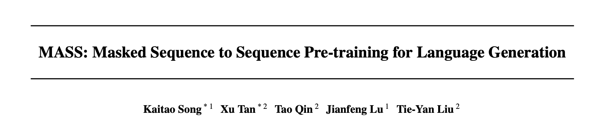

## MASS

- 论文：MASS: Masked Sequence to Sequence Pre-training for Language Generation
- 地址：https://arxiv.org/abs/1905.02450
- 源码：https://github.com/microsoft/MASS

我们知道，bert 只使用了 Transformer 的 encoder 部分，其下游任务也主要是适用于自然语言理解（NLU），对于类似文本摘要、机器翻译、对话应答生成等自然语言生成（NLG）任务显然是不太合适的。

BERT 的大火，也带动了 NLP 届的 pre-training 大火，受到 bert 的启发，作者们提出联合训练 encoder 和 decoder 的模型：**Masked Sequence to Sequence Pre-training for Language Generation（MASS）**，框架如下：  训练步骤主要分为两步： 

1.  **Encoder：** 输入为被随机 mask 掉连续部分 token 的句子，使用 Transformer 对其进行编码；这样处理的目的是可以使得 encoder 可以更好地捕获没有被 mask 掉词语信息用于后续 decoder 的预测；
2.  **Decoder：** 输入为与 encoder 同样的句子，但是 mask 掉的正好和 encoder 相反，和翻译一样，使用 attention 机制去训练，但只预测 encoder 端被 mask 掉的词。该操作可以迫使 decoder 预测的时候更依赖于 source 端的输入而不是前面预测出的 token，防止误差传递。

MASS 预训练输入为 $m$ 个 token 的句子 $x=\left(x_{1}, x_{2}, \ldots, x_{m}\right)$，将位置 $u$ 到 $v$ 之间的 mask 掉之后的输入为 $x^{ \backslash u : v}$，其中 $x^{u : v}$ 表示被 mask 掉的片段。MASS 预训练目的预测输入中被 mask 掉的 $x^{u : v}$
$$
L(\theta ; \mathcal{X})=\frac{1}{|\mathcal{X}|} \Sigma x \in \mathcal{X} \log P\left(x^{u: v} \mid x^{\backslash u: v} ; \theta\right) \quad=\frac{1}{|\mathcal{X}|} \sum x \in \mathcal{X} \log \prod t=u^{v} P\left(x t^{u: v} \mid x<t^{u: v}, x^{\mid u: v} ; \theta\right)
$$
此外，作者们还提出了一个对于 mask 长度的超参数 $k$，并指出当 k=1 时，即 encoder 屏蔽一个 token，decoder 没有输入，该形式与 BERT 的 MLM 训练模型一致。（但是 BERT 不是随机离散 mask 的嘛，好像还不太一样）

当 k=m 时，即 encoder 完全 mask 掉，decoder 输入为完整句子，该形式与 OPENAI 的 GPT 模型一致  

由于 K 值为超参数，属于人为设定，作者们又在文章末尾对其进行了分析，通过多个试验表明，当 k 为句子长度的 50%~70% 时模型效果最好。 

**reference**

- [ICML 2019|序列到序列自然语言生成任务超越BERT、GPT！微软提出通用预训练模型MASS](https://zhuanlan.zhihu.com/p/65346812)
- [如何看待 MSRA 在 ICML'19 上的工作 MASS?](https://www.zhihu.com/question/324019899)

