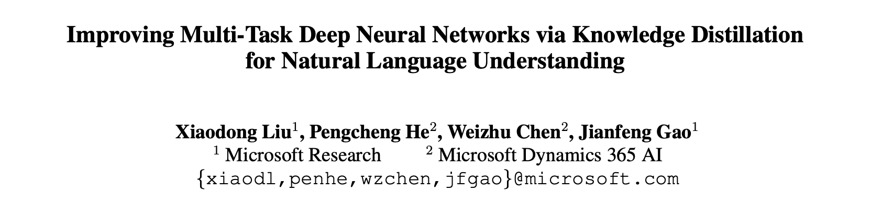
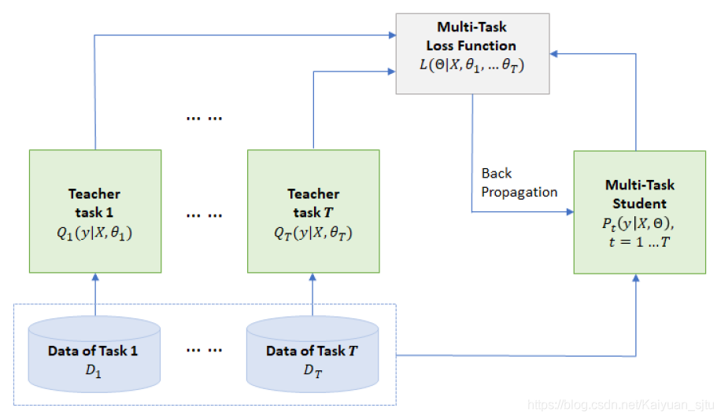
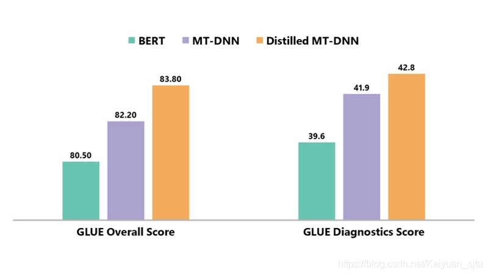

- 论文：Improving Multi-Task Deep Neural Networks via Knowledge Distillation for Natural Language Understanding
- 地址：https://arxiv.org/pdf/1904.09482.pdf
- 源码：https://github.com/namisan/mt-dnn

虽然 ensemble 模型可以有效提高模型表现，但是由于集成学习的规模十分之巨大，导致运算和部署的成本非常高。显然 MT-DNN 的作者也考虑到了这个问题，于是提出了改进版：MT-DNN-2，采用知识蒸馏的方式，将庞大复杂的 teacher 模型所学习到的 “知识” 给蒸馏出来转移到一个更小的 student 模型，并保证不会有明显的损失。

本文采用的 base model 就是 MT-DNN，其具体结构以训练方式都在上一节介绍过。下面我们关注知识蒸馏部分。

对不同的任务（有标注数据的），训练多个神经网络为一个集成学习模型，即 teacher 模型。其中每个神经网络为之前的 vanilla MT-DNN，共享层参数是在 GLUE 数据集上预训练得到的，然后在特定的任务上进行微调。

对每个 task 中的训练样本，teacher model 会生成一个 **soft target** 集合。文中举了文本分类的任务，每个神经网络对每个类别的 prediction 通过 softmax 得到，让我们先想想普通训练的损失函数是什么样的 (hard target）
$$
\text { Loss }_{\text {hard }}=-\sum_{c} 1(X, c) \log \left(P_{r}(c \mid X)\right)
$$
那么采用了知识蒸馏之后呢？我们的目标是用一个 student mode l来转移 teacher model 所学习到的信息。通过 teacher model 对各个网络的分类概率值进行平均，得到 soft target：
$$
\begin{array}{l}
Q=\operatorname{avg}\left(\left[Q^{1}, Q^{2}, \ldots, Q^{K}\right]\right) \\
\text { Loss }_{\text {soft }}=-\sum_{c} Q(c \mid X) \log \left(P_{r}(c \mid X)\right)
\end{array}
$$
其中不同的是 $Q$,这就是知识蒸馏的关键。teacher model 所产生的分类的相对概率值已经包含了 teacher 该如何泛化的信息，导致了 teacher model 的 soft target 熵更高，也就比 hard target 提供更多信息。

当正确的 target 已知时，联合 soft target 和 hard target 进行训练可以显著提升性能 
$$
\text{Loss} = \alpha * \text{Loss}_{soft} + (1 - \alpha) * \text{Loss}_{hard}
$$
Hinton 建议第一个损失项的权重取低一些，但是在本文的实验中，没有观察到对这两个损失项分别使用不同的权重有任何显著差异。

MT-DNN-ensemble 在 GLUE 上突破了各项亮眼的成绩：[GLUE基准新突破：微软多任务模型首次超越自然语言人类基准](https://zhuanlan.zhihu.com/p/68602190) 

**reference**

- [Robust Language Representation Learning via Multi-task Knowledge Distillation](https://www.microsoft.com/en-us/research/blog/robust-language-representation-learning-via-multi-task-knowledge-distillation/)
- [官方源码](https://github.com/namisan/mt-dnn)