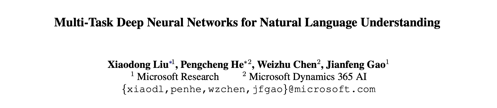
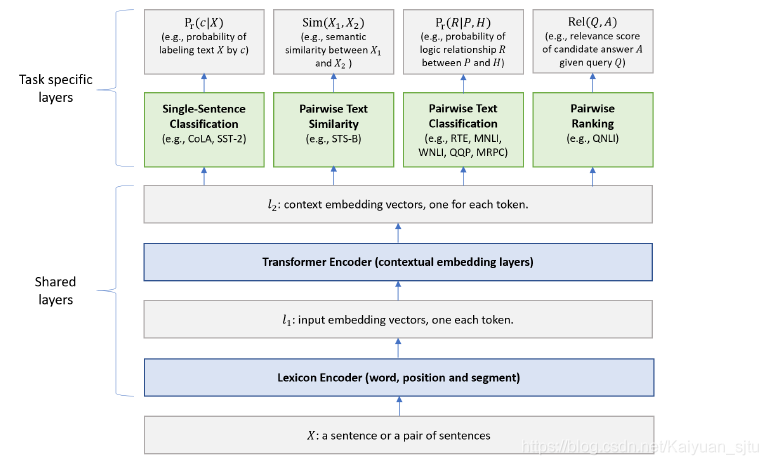
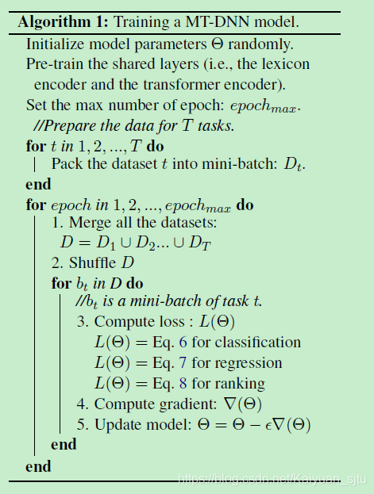
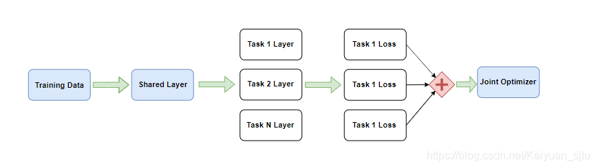
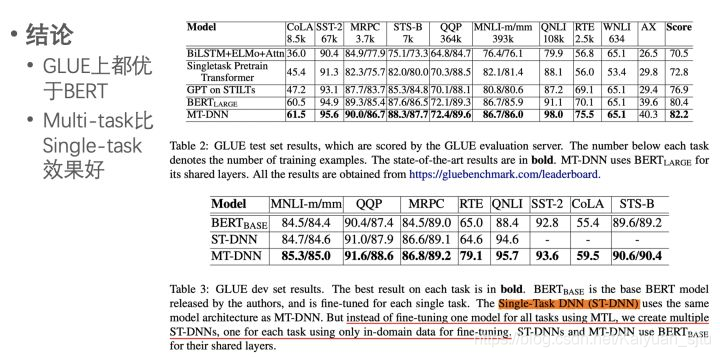

- 论文：Multi-Task Deep Neural Networks for Natural Language Understanding
- 地址：https://www.aclweb.org/anthology/P19-1441.pdf
- 源码：https://github.com/namisan/mt-dnn

> 数据决定了上限，而模型和算法只是无限逼近这个上限

在 NLP 领域中也是如此，有监督的模型效果好，但是有标签的数据获取却非常难。一种有效的解决方案是采用多任务学习（Multi Task Learning MLT），一方面可以在数据标注较少的情况下利用其它相似任务的标注数据，另一方面可以降低针对特定任务的过拟合，起到正则化l的作用。

本文的模型正是采用了多任务学习+无监督语言训练，在 11 项 NLP 任务中有 9 项超过了原始的 BERT 模型。模型框架如下，思路也很简单，主要就是在 BERT 之上叠加了四大类学习任务。下面我们来具体看看 

### Shared layers

模型的下层就是直接套用了 BERT，没有变化，共享参数的训练也是采用 MLM+NSP

### Task specific layers

文中采用了四大类预训练任务来进行多任务学习，基本都涵盖了 GLUE 里的 NLU 任务

- **Single Sentence Classification**：采用 [CLS] 作为句子编码表示，激活函数为 softmax，损失函数为交叉熵
    $$
    P_r(c∣X)=\mathbb{softmax}(W_{SST}^⊤⋅x) −∑_c 1(X,c) \log⁡(P_r(c∣X))
    $$
    
- **Pairwise Text Similarity**：采用 [CLS] 作为句子编码表示，激活函数为 sigmoid，损失函数为 MSE
    $$
    sim(X1,X2)=g(w⊤_{STS}⋅x)$$$$(y−sim(X_1,X_2))^2
    $$

- **Pairwise Text Classification**：分别将第一句和第二句的词编码拼接，参考 SAN 模型迭代推理结果,损失函数为交叉熵
    $$
    P{r}^{k}=\operatorname{softmax}\left(\mathbf{W}{3}^{\top}\left[\mathbf{s}^{k} ; \mathbf{x}^{k} ;\left|\mathbf{s}^{k}-\mathbf{x}^{k}\right| ; \mathbf{s}^{k} \cdot \mathbf{x}^{k}\right]\right) \\
    P{r}=\operatorname{avg}\left(\left[P{r}^{0}, P{r}^{1}, \ldots, P{r}^{K-1}\right]\right)-\sum_{c} \mathbb{1}(X, c) \log \left(P{r}(c | X)\right)
    $$

- **Pairwise Ranking**：采用 [CLS] 作为句子编码表示，激活函数为 sigmoid
    $$
    {Rel}(Q, A)=g\left(\mathbf{w}_{Q N L I}^{\top} \cdot \mathbf{x}\right)-\sum{\left(Q, A^{+}\right)} P_{r}\left(A^{+} | Q\right) \\
    P_{r}\left(A^{+} | Q\right)=\frac{\exp \left(\gamma \operatorname{Rel}\left(Q, A^{+}\right)\right)}{\sum_{A^{\prime} \in \mathcal{A}} \exp \left(\gamma \operatorname{Rel}\left(Q, A^{\prime}\right)\right)}
    $$

### Training Procedure

训练过程大致可以分为两步: **BERT 预训练**和**多任务学习**

对于多任务学习作者首先将不同任务制作成 mini-batch 后扔到一起成为数据集 D，然后将 D 打乱后依次取出一个batch 的数据 $b*{t}$ 进行训练，注意这里 $ b*{t}$包含了各种任务的训练数据，这种 MTL 的方式也叫做联合训练（相对于交替训练），可以有效避免模型偏向某个任务。

**reference**

- [NLP的bert和后bert时代的挑战](https://zhuanlan.zhihu.com/p/66676144)
- [GLUE基准新突破：微软多任务模型首次超越自然语言人类基准](https://zhuanlan.zhihu.com/p/68602190)
- [官方源码](https://github.com/namisan/mt-dnn)