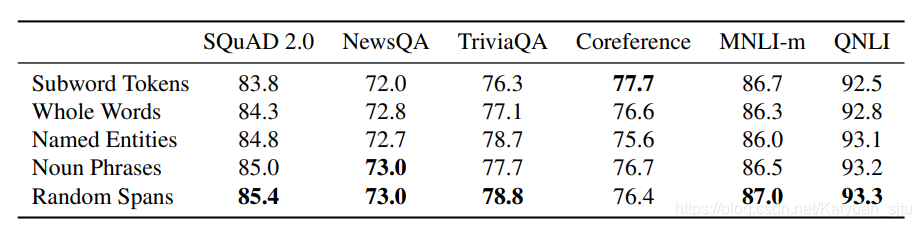

## Span-BERT

- 论文：SpanBERT: Improving Pre-training by Representing and Predicting Spans
- 地址：https://arxiv.org/pdf/1907.10529.pdf
- 源码：https://github.com/facebookresearch/SpanBERT

和 Whole Word Masking BERT 以及 ERNIE 类似，SpanBERT 这里也是选择对原始 BERT 的 mask 策略进行调整，不过前者是在 phrase/entity 的级别进行 mask，而 spanBERT 则是选择了更长的范围进行 mask，试验结果指出该种策略会对 span selection 任务有较明显的提高，比如问答、指代消解等。相比于原始 BERT，这里创新点可以认为是以下两点：

- `mask策略`：随机 **mask span**，而不是 token

- `预训练目标`：为了与新提出的 mask 策略相匹配，提出了**span-boundary objective (SBO)**；同时发现 NSP 对下游任务的表现并不好，果断抛弃。

okay，让我们来看看这个 span masking 和 SBO 到底是怎么实现的。

### Span Masking

对于输入 $X=\left(x_{1}, \ldots, x_{n}\right)$, span masking 的具体做法是：首先通过几何分布 $ℓ∼Geo(p)$ 采样出 span 的长度，然后随机选择 span 的起始位置。如此迭代进行，直到采样出的 span 长度达到 15% 的输入长度。

作者设置 p=0.2p=0.2p=0.2 并且丢弃长度大于 10 的 span（确实呀把十个单词都给抹去，还要求模型预测出来，这有点过分了），经过计算最后得出 span 的平均长度为 3.8 个单词，注意这里的单词是完整的单词而不是subword。

那么 span masking 相对于之前的全词 masking 以及 entity masking 效果怎么样呢？作者在 ablation study 中也对其进行了验证。挑选了几种不同的 masking 策略进行对比，除了**指代消解**任务，其他下游任务中 span masking 都表现出更好的效果。

### Span-Boundary Objective (SBO)

SBO 的思想就是通过已知的边界去预测未知的被 mask 掉的那些 token。具体而言，对于一个 span $\left(x_{s}, \ldots, x_{e}\right)$ ,其中 $x_s$ *和* $x_e$ 分别是 span 的起始和终止位置。对于每一个被 mask 的词，SBO 使用 span 起始位置的前一个 token $x_{s-1}$ 和终止位置的后一个 token $x_{e+1}$ 以及被 mask 掉 token 的位置向量 $p_{i}$ 来表示该 token：
$$
\begin{array}{l}
\mathbf{y}_{i}=f\left(\mathbf{x}_{s-1}, \mathbf{x}_{e+1}, \mathbf{p}_{i}\right) \mathbf{h}=\text { LayerNorm }\left(\operatorname{GeLU}\left(W_{1} \cdot\left[\mathbf{x}_{s-1} ; \mathbf{x}_{e+1} ; \mathbf{p}_{i}\right]\right)\right) \\
f(\cdot)=\text { LayerNorm }\left(\operatorname{GeLU}\left(W_{2} \cdot \mathbf{h}\right)\right)
\end{array}
$$
举个栗子可以看下图，最终的模型是将 MLM 和 SBO 两个损失相加进行训练。 

### Single-Sequence Training

其实这里就是对原始 BERT 中 NSP 任务的解读，在作者们的实验中发现不使用 NSP 进行预训练得到的模型效果反而更好，即 **Single-Sequence Training**，下表中 **2seq** 表示`segment_a + segment_b`的输入形式 

推测可能是由于 (a) 长度更长的完整文本包含信息更全；(b) 从另一个文档中选取下一句会对模型引入噪声。

