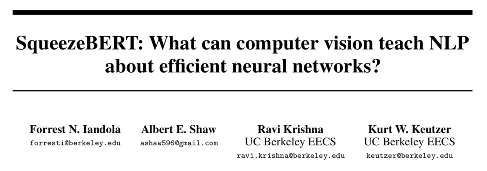

- 论文：SqueezeBERT: What can computer vision teach NLP about efficient neural networks?
- 地址：https://arxiv.org/abs/2006.11316
- 源码：https://github.com/huggingface/transformers/

核心思想：把全连接全部替换为卷积的 BERT。

### 背景动机

依然是对 BERT 系列模型架构的优化，出发点是提升运行速度。只不过本文是基于对图像领域技术的迁移，比如 grouped convolutions。具体来说，就是将 Self-Attention 的一些操作替换成卷积。最终达到比 BERT-base 快 4.3 倍的效果。

**已有 CV 迁移 NLP 的技术**

主要代表是 MobileBERT，使用了两个技术：

- Bottleneck layers（见下图）
- High-information flow residual connections，主要是针对 feed-forward layer，Self-Attention 本来就有。


图片来自：https://paperswithcode.com/method/bottleneck-residual-block

**CV 还有哪些高效网络可以用到 NLP**

- Convolutions
- Grouped convolutions

### 算法模型

#### Self-Attention + Convolutions

首先看一下 BERT 各个组件的耗时：


接下来就是要将 Encoder 中的 FC 替换为卷积。FC 如下：
$$
\text { PositionwiseFullyConnected }_{p, c_{o u t}}(f, w)=\sum_{i}^{C_{i n}} w_{c_{o u t}, i} * f_{p, i}
$$
p 是 position，也就是 sequence length，Cin 和 Cout 表示输入和输出的通道。用卷积替换：
$$
\text { Convolution }_{p, c_{\text {out }}}(f, w)=\sum_{i}^{C_{\text {in }}} \sum_{k}^{K} w_{c_{\text {out }}, i, k} * f_{\left(p-\frac{K-1}{2}+k\right), i}
$$
k=1 时，两者是等价的。代码更加直观：

```python
# code from transformers
class FC(nn.Module):
    def __init__(self, cin, cout, groups, act):
        super().__init__()
        self.conv1d = nn.Conv1d(
            in_channels=cin, out_channels=cout, kernel_size=1, groups=groups)
        self.act = ACT2FN[act]

    def forward(self, x):
        output = self.conv1d(x)
        return self.act(output)
```

对应的原始版本是：

```python
# code from transformers
class BertIntermediate(nn.Module):
    def __init__(self, config):
        super().__init__()
        self.dense = nn.Linear(config.hidden_size, config.intermediate_size)
        self.intermediate_act_fn = ACT2FN[config.hidden_act]

    def forward(self, hidden_states):
        hidden_states = self.dense(hidden_states)
        hidden_states = self.intermediate_act_fn(hidden_states)
        return hidden_states
```

另外，针对 Self-Attention 和 Intermediate 之后的残差连接归一化层，其中的全连接部分也是用卷积替换：

```python
# code modified from transformers
class ConvDropoutLayerNorm(nn.Module):
    def __init__(self, cin, cout, groups, dropout_prob):
        super().__init__()
        self.conv1d = nn.Conv1d(
            in_channels=cin, out_channels=cout, kernel_size=1, groups=groups)
        self.layernorm = nn.LayerNorm(cout)
        self.dropout = nn.Dropout(dropout_prob)

    def forward(self, hidden_states, input_tensor):
        x = self.conv1d(hidden_states)
        x = self.dropout(x)
        x = x + input_tensor
        x = x.permute(0, 2, 1)
        x = self.layernorm(x)
        x = x.permute(0, 2, 1)
        return x
```

这里注意 LN 的是 hidden size 维度。对应的 BERT 版本是：

```python
# code from transformers
class BertOutput(nn.Module):
    def __init__(self, config):
        super().__init__()
        self.dense = nn.Linear(in_channels, out_channels)
        self.LayerNorm = nn.LayerNorm(config.hidden_size, eps=config.layer_norm_eps)
        self.dropout = nn.Dropout(config.hidden_dropout_prob)

    def forward(self, hidden_states, input_tensor):
        hidden_states = self.dense(hidden_states)
        hidden_states = self.dropout(hidden_states)
        hidden_states = self.LayerNorm(hidden_states + input_tensor)
        return hidden_states
```

通过代码可以清楚地发现，唯一的改动就是将 Dense 变成 Conv1D。需要注意的是，Self-Attention 出来的 全连接层 group = 1，Intermediate 和 Intermediate 的全连接层 group = 4。

#### Self-Attention + Grouped Convolutions

接下来是对 Attention 中的全连接进行改造：
$$
\text { GroupedConvolution }_{p, c_{o u t}}(f, w)=\sum_{i}^{\frac{C_{i n}}{G}} \sum_{k}^{K} w_{c_{o u t}, i, k} * f_{\left(p-\frac{K-1}{2}+k\right),\left(i+\left\lfloor\frac{(i)(G)}{C_{o u t}}\right\rfloor \frac{C_{i n}}{G}\right)}
$$
相当于把输入的向量切分成 G 个相互独立的卷积网络，FLOPs 变为 1/G，类似这样：

```python
##### PyTorch #####
m = nn.Conv1d(768, 64, 3, stride=1, padding=0, groups=2)
input = torch.randn(4, 768, 512)
m(input).shape, m.weight.shape
# (torch.Size([4, 64, 510]), torch.Size([64, 384, 3]))

##### Tensorflow #####
class CnnTestModel(tf.keras.layers.Layer):
    def __init__(self):
        super().__init__()
        self.n = tf.keras.layers.Conv1D(
            64, 3, strides=1, padding='valid', groups=2, activation='relu')
    
    @tf.function(experimental_compile=True)
    def call(self, x):
        out = self.n(x)
        print(self.n.weights[0].shape, self.n.weights[1].shape)
        return out

ctm = CnnTestModel()
# batch_size, seq_len, hidden_size
x = tf.random.normal((4, 512, 768))
out = ctm(x)
out.shape
# (3, 384, 64) (64,)
# (3, 384, 64) (64,)
# TensorShape([4, 510, 64])
```

Tensorflow 的 groups 目前不支持 CPU，因此需要用 `tf.function` 的 `experimental`。输出两次是因为第一遍是构件图时输出的，第二遍是执行计算时输出的。更多关于 Group Conv 可以参考[这篇](https://arxiv.org/pdf/1605.06489.pdf)论文。

具体在 Self-Attention 中是这样的：

```python
# from transformers
class SqueezeBertSelfAttention(nn.Module):
    def __init__(self, config, cin, q_groups, k_groups, v_groups):
        super().__init__()
        self.query = nn.Conv1d(
            in_channels=cin, out_channels=cin, kernel_size=1, groups=q_groups)
        self.key = nn.Conv1d(
            in_channels=cin, out_channels=cin, kernel_size=1, groups=k_groups)
        self.value = nn.Conv1d
        in_channels=cin, out_channels=cin, kernel_size=1, groups=v_groups)
        ...
```

groups 的参数在 config 中都是 4。

### 实际效果

#### 数据说明

- Pretraining: Wikipedia + BooksCorpus, 3% test, MLM + SOP
- Finetuning: GLUE

#### 训练方法

- 从头训练：
    - 预训练：LAMB optimizer，batch_size 8192，learning_rate 2.5e-3，warmup proportion 0.28，56k sequence length 128, 6k 512
    - 微调阶段：AdamW without momentum or weight decay with β1 = 0.9 and β2 = 0.999，batch_size 16
- 蒸馏：
    - 只在微调阶段，蒸馏最后一层
    - 预训练后在 MNLI 上微调，然后再到其他任务

#### 实验报告

代表性看一下 test set 的结果：


综合这个结果看，我认为 TinyBERT 不错：D

### 相关讨论

- NLG 任务中的应用：
    - Evolved Transformer 和 Lite Transformer 在网络的不同部分中包含 Self-Attention 和卷积。
    - LightConv 表明精心设计的卷积网络（没有 Self-Attention）和 Self-Attention 网络在部分 NLG 任务上取得相当的结果。
- 从 CV 到 NLP 还有什么：
    - 下采样策略：随着层不断往前，减少 Self-Attention 中激活的序列长度。 
    - U-Nets（U-net: Convolutional networks for biomedical image segmentation）

