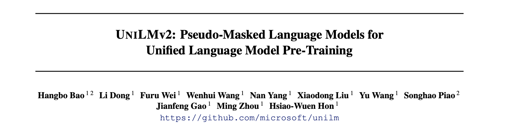
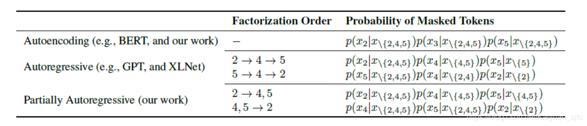
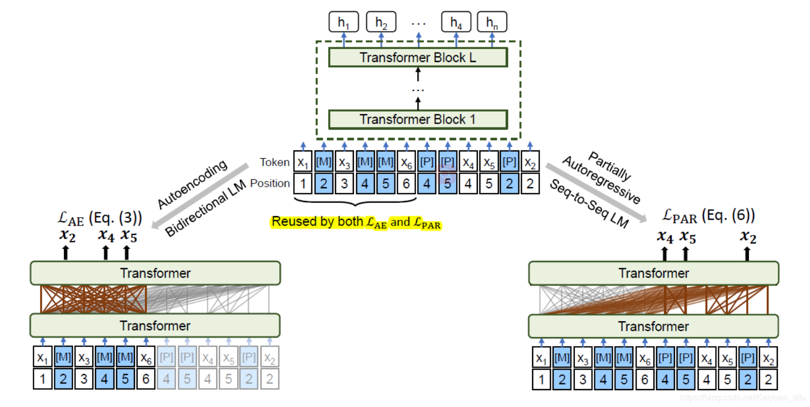
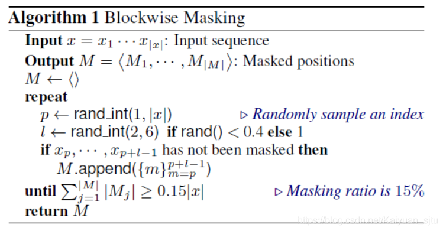
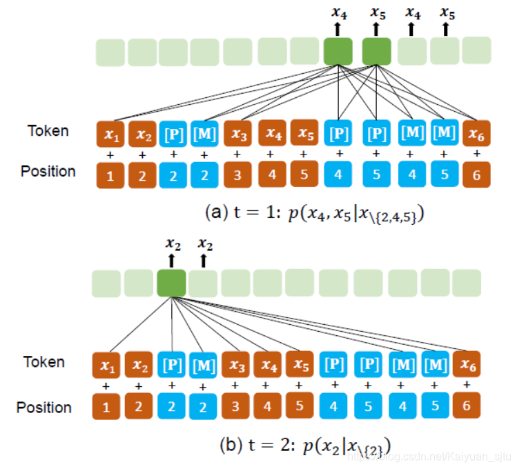
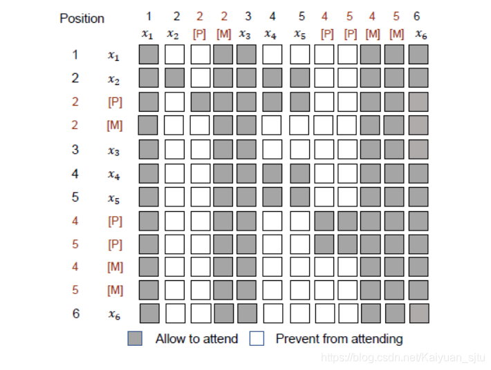
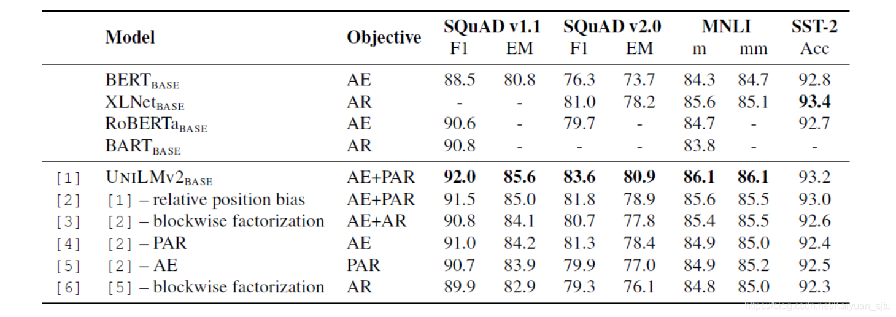

- 论文：UNILMv2: Pseudo-Masked Language Models for Unified Language Model Pre-Training
- 地址：https://arxiv.org/abs/2002.12804
- 源码：https://github.com/microsoft/unilm

刷 arxiv 看到了之前比较喜欢的一个工作 UNILM 的续集，这不得提高优先级先来品品（虽然还有一大堆 TODO）。关于 UNILM 1.0 在之前的文章中已经有介绍了，见[站在BERT肩膀上的NLP新秀们（PART II）](https://blog.csdn.net/Kaiyuan_sjtu/article/details/90814031)，这种做到 NLU 和 NLG 简洁统一的框架真的是非常赞！

目前 NLP 预训练模型主要采取两大类预训练目标来进行语言模型训练：Auto-encoding（如BERT等）和 Auto-regressive（如 GPT/XLNEet 等）。如下图，简单来说 Auto-encoding 就是类似 BERT 那样的通过 [MASK] 标记来获取前向和后向的信息；而 Auto-regressive 呢就是自左向右或者自右向左地对文本进行语言建模，它的好处是对生成任务有天然的优势，缺点呢就是只能得到单向的信息不能同时利用上下文的信息。 

而本文使用的`Partially Auto-Regressive`则可以认为是对`Auto-regressive`的扩展，将 token 级别扩展到了span 级别，并且不限制方向性。

## 模型预训练

UNILM 2.0 的模型框架没有什么好说的，骨架网络就是 Transformer，跟主流的都差不多，论文的亮点在于预训练目标。在一个统一的 BERT 式的网络基础上，设计了两种预训练目标，**自编码**和**部分自回归**，分别对应双向语言模型和 seq2seq 语言模型， 然后进行联合训练：
$$
\mathcal{L}=\mathcal{L}_{\mathrm{AE}}+\mathcal{L}_{\mathrm{PAR}}
$$

### 自编码

上图中左半部分，自编码（Auto Encoding，AE）就像 BERT 一样，利用已知的上下文信息来单独地计算被 MASK掉的 token 的概率。
$$
\mathcal{L}_{\mathrm{AE}}=-\sum_{x \in \mathcal{D}} \log \prod_{m \in M} p\left(x_{m} \mid x_{\backslash M}\right)
$$
其中， $M=({m_{1}, \cdots, m_{|M|}})$ 为被 mask 词集合，$x_{\backslash M}$ 表示除去 mask 词集的其他词*，* $x_{m}$ 则表示被 mask 词， D 表示训练语料集合。

### 部分自回归

上图中右半部分，部分自回归（Partially AutoRegressive，PAR ）在每一步因式分解的时候可以选择预测单个token 或多个 tokens（为连续的 span），当所有步均选择预测一个 token 时，则会变为自回归模式。 
$$
\begin{aligned}
p\left(x_{M} \mid x_{\backslash M}\right) &=\prod_{i=1}^{|M|} p\left(x_{M_{i}} \mid x_{\backslash M_{\geq i}}\right) \\
&=\prod_{i=1}^{|M|} \prod_{m \in M_{i}} p\left(x_{m} \mid x_{\backslash M \geq i}\right)
\end{aligned}
$$
其中， $x_{M{i}}=\{{x{m}}\}_{m \in M{i}}$ 表示第 i 步需要预测的 token*，* $M_{\geq i}=\bigcup_{j \geq i} M_{j}$ 表示还没有预测出的词（每一步都不一样）。所以部分自回归预训练损失可以表示为：
$$
\mathcal{L}_{\mathrm{PAR}}=-\sum_{x \in \mathcal{D}} \mathbb{E}_{M} \log p\left(x_{M} | x_{\backslash M}\right)
$$
其中， $\mathbb{E}_{M}$ 是分解的期望，但是在预训练中只随机采用一种分解

### 关于Mask的策略

对于输入，随机采样 15% 作为 mask 集合，这其中 40% 的概率 mask 掉长度为 2 到 6 的 n-gram 连续 span，60% 的概率 mask 单独一个 token。

### 伪掩码语言模型

正如前面提到的，如果要用部分自回归的话，每一步预测时可用的 tokens 是不一样的，因此如果直接使原始BERT 中的 MLM，必须为每个分解步骤构建一个新的 Cloze 实例，这将导致部分自回归的预训练不可行。

为此提出了一种 **Pseudo-Masked LM(PMLM)**  的训练方式，简单来说就是对 masked token 额外添加一个带对应位置编码信息的标记 [P]，用于在部分自回归预训练时预测的 placeholder。

举个栗子，对于第一幅图中的最后一个例子，即`4,5——>2`，下图为 PMLM 进行部分自回归预测的流程。

- Step 1：通过计算 $p\left(x_{4}, x_{5} | x_{\backslash{2,4,5}}\right)$ 来同时  预测 $x$ 和 $x_5$，为了避免信息泄露，这一步 attend 的元素为 $x_{1}, x_{3}, x_{6}$ 以及 $[P]_{4}$ 和 $[P]_{5}$ 。
- Step 2：通过计算 $p\left(x_{2} | x_{\backslash{2}}\right)$ 来预测 $x_{2}$ *，*这一步可以获取上一步得出的结果，即这一步 attend 的元素*为* $x_{1}, x_{3}, x_{4}, x_{5}, x_{6}$ 以及 $[P]_{2}$ 

具体实现的话，基本思想还是跟 UNILM 1.0 一样的，即`Self-Attention Masks`，来控制计算某一个 token 时其他元素可以 attend 的权限。以上图为例，其 Self-Attention Masks 矩阵为，  

可以看到，[M] 和已知的 $\left(x_{1}, x_{3}, x_{6}\right)$ 可以被全局 attend。[M] 对 AE 部分来说，因为是 bidirectional，所以互相都允许 attend；对 PAR 部分，可以提供”完整“的 context（比如对 P4/P5 来说，就可以看到 M2），这样避免了之前 autoregressive 不能看 future context，导致一些位置被完全 masked。

### 模型输入

在预训练阶段，模型输入形式为：`[SOS] S1 [EOS] S2 [EOS]`，其中 S1 和 S2 是连续的文本，[SOS] 和 [EOS] 是表示文本起始以及结束的特殊标记，输入 token 的表示是 word embedding, absolute position embedding 以及 segment embedding 的加和。

在微调阶段，不同任务的输入形式不同：

- 对于 NLU 任务，输入为`“[SOS] TEXT [EOS]`，然后用`[SOS]`作为text的表示用于下游任务；
- 对于 NLG 任务，输入为`[SOS] SRC [EOS] TGT [EOS]` ，一旦解码出`[EOS]`，则停止解码，解码阶段使用beam search；

## 实验部分

论文中也展示了很多具体实验，QA、GLUE、Abstractive Summarization、Question Generation，就不展开，粗瞄一眼效果都很不错的样子，感兴趣的自行阅读~

还是消融性实验比较有趣，作者在多个任务上对 UNILN2.0 的组件进行拆解，各模型表现如下表。 

### 随便唠唠

UNILM1.0 刚出来的时候同期还有一个 MASS，也是微软的，MASS 的做法是显式地设计一个 Encoder 和一个Decoder 来做 seq2seq 生成。而 UNILM1.0 是使用了一个更为优雅的设计，即通过 attention mask 矩阵来达到在一个单独的 BERT 中实现 seq2seq 任务，不显式区分 encoder 和 decoder。

- UNILM2.0 是对 1.0 中的 seq2seq 预训练任务进行了优化，引入了部分自回归训练目标，可能是受了 XLNet的启发，PMLM 中的特殊标记 [P] 的作用有点类似于 XLNet 中的双流自注意力机制。

    > **来自论文作者董神**：有点儿 三流注意力（真实、mask、pseudo mask）的意思，motivation 就是最大限度重用计算的 hidden states，来实现 unified language model pretraining 里的 bidirectional AE (bert) 和 seq2seq PAR (bart)

- 另外在预训练过程中，输入文本的上下文表示会被 AE 和 PAR 重复利用，避免了无关计算。

