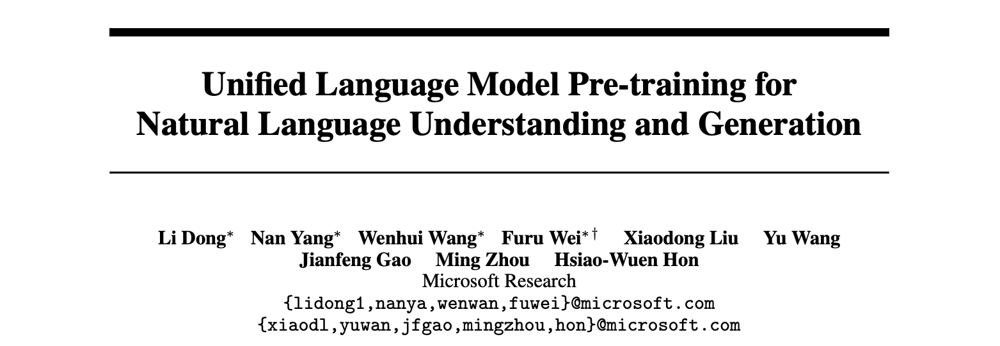
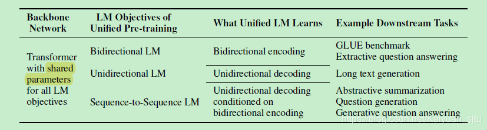
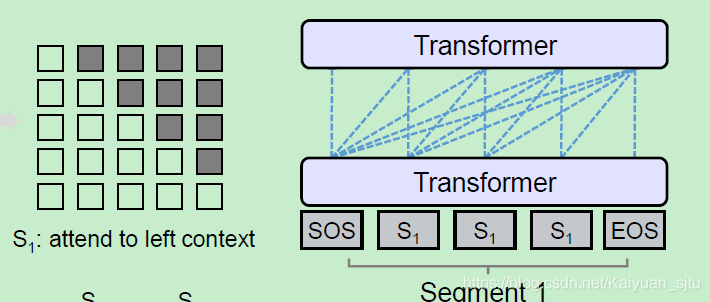
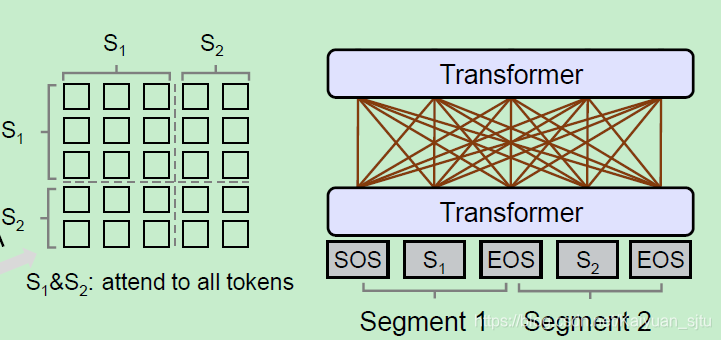

## UNILM

- 论文：Unified Language Model Pre-training for Natural Language Understanding and Generation
- 地址：https://arxiv.org/abs/1905.03197
- 源码：https://github.com/microsoft/unilm

这个就更炸了，也是微软的最近才放出的工作，直接预训练了一个微调后可以同时用于自然语言理解和自然语言生成下游任务的模型：**UNIfied pre-trained Language Model (UNILM)**。

看完论文之后会发现非常自然，使用的核心框架还是 Transformer，不同的是预训练的目标函数结合了以下三个：

- 单向语言模型（同ELMO/GPT）
- 双向语言模型（同BERT）
- seq2seq语言模型（同上一篇）

注意哦，这里的 Transformer 是同一个，即三个 LM 目标参数共享，有点 multi-task learning 的感觉，可以学习到更 general 的文本表示。

okay，来看模型 

### Input Representation

模型的输入是一个序列，对于单向 LM 是一个文本片段，对于双向 LM 和 seq2seq LM 是两段文本。embedding 模式使用的是跟 BERT 一样的三类：

- token embedding：使用 subword unit 
- position embedding：使用绝对位置
- segment embedding：区分第一段和第二段

另外，[SOS] 为输入序列起始标志； [EOS] 为在NLU任务中为两个 segment 的分界标志，在 NLG 任务中为解码结束标志。

### Backbone Network: Transformer

文中使用的是多层堆叠的 Transformer（24层，与$BERT_{large}$相同），输入表示为$\mathbf{H}^{0}=\left[\mathbf{x}{1}, \cdots, \mathbf{x}{|x|}\right]，$第 K 层的输出可以表示为：
$$
H_k= {Transformer} k(H^{k−1})
$$
其中 $\mathbf{H}^{k}=\left[\mathbf{h}{1}^{k}, \cdots, \mathbf{h}{ | x ]}^{k}\right]$， $h{i}^{k}$ *表示输入* $x_{i}$ 在经过 K 层 transformer 之后的上下文表示。

重点来了。上面说将三个语言模型统一到了一起，那么是如何实现的呢？ 作者们这里使用的是 **Self-attention Masks**，即对不同的语言模型，设置不同的 mask 策略进行学习。在《Attention is all you need》一文中也有类似 mask 说明。
$$
\begin{array}{l}
\mathbf{Q}=\mathbf{H}^{l-1} \mathbf{W}_{l}^{Q}, \quad \mathbf{K}=\mathbf{H}^{l-1} \mathbf{W}_{l}^{K} \\
\mathbf{M}_{i j}=\left\{\begin{array}{ll}
0, & \text { allow to attend } \\
-\infty, & \text { prevent from attending } 
\end{array}\right.
\end{array} \\
\mathbf{A}_{l}=\operatorname{softmax}\left(\frac{\mathrm{QK}^{\top}}{\sqrt{d_{k}}}+\mathbf{M}\right)\left(\mathbf{H}^{l-1} \mathbf{V}_{l}\right)
$$
下面具体介绍各个模型的Mask策略。

#### Unidirectional LM

对于单向 LM（left-to-right or right-to-left），我们在做 attention 的时候对每一个词只能 attend 其一个方向的上下文。如对 left-to-right LM， 我们就只能 attend 该词左边的信息，需要将右侧的词给 mask 掉；对于 right-to-left LM 也是同理。这样我们得到的 Mask 矩阵就是一个上三角或者下三角。 

#### Bidirectional LM

和 BERT 一样，双向 LM 在训练时可以看到左边和右边的信息，所以这里的 Mask 矩阵全是 0，表示全局信息可以 attend 到该 token 上 

#### Sequence-to-Sequence LM

对于 seq2seq LM，情况稍微复杂一点点，有点像上述两个 Mask 矩阵的结合版本。该模型输入为两个 segment $S1$ 和 $S2$，表示为`“[SOS] t1 t2 [EOS] t3 t4 t5 [EOS]”`，encoder 是双向的即有四个 token 可以 attend 到 `t1` 和`t2`上；decoder 是单向的，仅仅能 attend 到一个方向的 token 以及 encoder 的 token，以`t4`为例，它只能有 6 个 token 可以 attend。 在训练时会随机 mask 掉两个 segment 中的 token，然后让模型去预测被 mask 掉的词。 

### Next Sentence Prediction

对于双向 LM，作者也设置了 NSP 预训练任务，除了特殊 TOKEN 不一样，其他跟 bert 是一样的。

试验部分我也不多做分析了哈~

### reference

- [BERT时代与后时代的NLP](https://mp.weixin.qq.com/s/U_pYc5roODcs_VENDoTbiQ)

