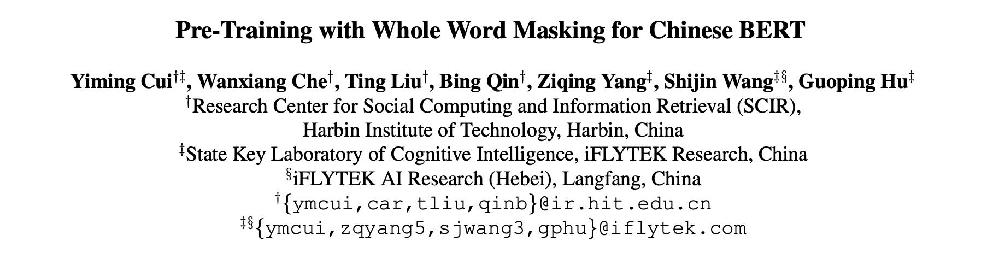

- 论文：Pre-Training with Whole Word Masking for Chinese BERT
- 地址：https://arxiv.org/pdf/1906.08101.pdf
- 源码：https://github.com/ymcui/Chinese-BERT-wwm

这篇文章（准确说是技术报告）的重点可以从标题一眼看出：**Whole Word Masking** 和 **Chinese BERT**。

**全词掩码Whole Word Masking**

首先让我们回想一下 vanilla BERT 的 mask 策略，对于一个输入首先是进行分词（WordPiece Tokenizer），接着随机地对输入进行 mask，最后利用 MLM 任务去训练模型。

> 解释一下 WordPiece Tokenizer（主要是为了去除未登录词对模型效果的影响），举个栗子，对于英文输入`unaffable`，分词结果就是`["un", "##aff", "##able"]`；而对于中文，则是直接按字切分。

那么这样做会导致什么结果呢？大概就是模型只能死板地记住每个词中字母的出现顺序，而不能理解词语的语义。所以最直接的做法就是把整个短语进行 mask，也就是这里的全词掩码。其实关于 mask 的范围，在这篇文章之前就有过 BERT+N-gram masking，有过百度的 ERNIE，BERT 原创团队也是提出了 Whole Word Masking（只不过是在英文数据上的）。所以的话这篇技术报告也是注重在对比 ERNIE/BERT 和 WWM-BERT 三者的模型效果上。

**训练细节**

虽然 WWM-BERT-ZH 只是在原始的 BERT 上修改的不多，但是按照惯例我们还是简单介绍一下模型训练的细节。

- **数据集**

    训练使用的语料是中文维基百科数据，包括简体和繁体的。分词的工具是哈工大的 LTP，其他数据预处理的方式保持跟 vanilla bert 一致（一切为了公平）

- **post-train**

    接下来的训练可以说是 pre-train， 也可以认为是 post-train。因为作者认为 WWM-BERT-ZH 是 BERT 的一部分而不是一个全新 model，所以他们选择在 BERT-BASE-ZH 的基础上继续训练。模型首先在最长样本长度为 128，批大小为 2560，使用 1e-4 的学习率，初始预热为 10% 的条件下训练了 100k 轮，然后在序列长度为 512，批大小为 384 的样本上进行了同样轮次的训练。训练使用了 LAMB 目标函数，而非 AdamWeightDecayOptimizer。训练使用的是 Google Cloud TPU v3，有 128G HBM。

**模型效果比对**

作为模型效果对比的下游任务，作者选取了 sentence-level 到 document-level 的以下几个任务：

- 机器阅读理解：CMRC 2018 , DRCD , CJRC（这些是数据集）
- 命名实体识别：People Daily, MSRA-NER 
- 自然语言推理：XNLI
- 情感分类：ChnSentiCorp, Sina Weibo
- 句子对匹配：LCQMC, BQ Corpus
- 文档分类： THUCNews

okay，关于模型对比的具体结果这里篇幅有限就不贴上来了，大家感兴趣的可以点击标题超链接去文章里看。粗略统计了一下，六项比对任务中，ERNIE 赢得四项，WWM-BERT-ZH 赢得两项，BERT-ZH...

**reference**

- [【官方github】](https://github.com/ymcui/Chinese-BERT-wwm)
- [【哈工大讯飞联合实验室发布基于全词覆盖的中文BERT预训练模型】](https://mp.weixin.qq.com/s/EE6dEhvpKxqnVW_bBAKrnA)
- [【中文最佳，哈工大讯飞联合发布全词覆盖中文BERT预训练模型】](https://www.jiqizhixin.com/articles/2019-06-21-01)