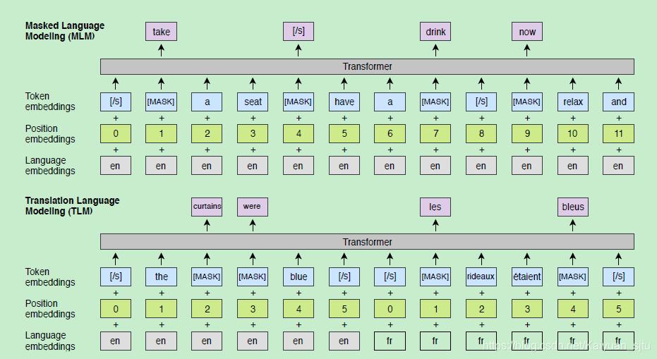

## XLM

- 论文：Cross-lingual Language Model Pretraining
- 地址：https://arxiv.org/abs/1901.07291
- 源码：https://github.com/facebookresearch/XLM

对于 BERT 的改进可以大体分为两个方向：第一个是纵向，即去研究 bert 模型结构或者算法优化等方面的问题，致力于提出一种比 bert 效果更好更轻量级的模型；第二个方向是横向，即在 bert 的基础上稍作修改去探索那些vanilla bert 还没有触及的领域。直观上来看第二个方向明显会比第一个方向简单，关键是出效果更快。本文就属于第二类。

> 突然想起来有一次面试，面试官问完 bert 的原理之后又接着问了 bert 的缺点在哪，当时也没有看到这些改进 bert 的论文，傻乎乎地不知道回答什么。大家可以思考一下~

我们知道，bert 预训练的语料全是单语言的，所以可想而知最终的模型所适用的范围基本也是属于单语范围的 NLP 任务，涉及到跨语言的任务可能表现就不那么好。基于此，作者们提出了一种有效的跨语言预训练模型，**Cross-lingual Language Model Pretraining（XLMs）。** XLMs 可以认为是跨语言版的 BERT，使用了两种预训练方式

- 基于单语种语料的无监督学习
- 基于跨语言的平行语料的有监督学习

其在几个多语任务上比如 XNLI 和机器翻译都拉高了 SOTA。那么我们就来看看具体的模型，整体框架和 BERT 是非常类似，修改了几个预训练目标。

### Shared sub-word vocabulary

目前的词向量基本都是在单语言语料集中训练得到的，所以其 embedding 不能涵盖跨语言的语义信息。为了更好地将多语言的信息融合在一个共享的词表中，作者在文本预处理上使用了字节对编码算法（**Byte Pair Encoding (BPE)**），大致思想就是利用单个未使用的符号迭代地替换给定数据集中最频繁的符号对（原始字节）。这样处理后的词表就对语言的种类不敏感了，更多关注的是语言的组织结构。

关于 BEP 的具体栗子可以参考：[Byte Pair Encoding example](https://gist.github.com/ranihorev/6ba9a88c9e7401b603cd483dd767e783)

### Causal Language Modeling (CLM)

这里的 CLM 就是一个传统的语言模型训练过程，使用的是目前效果最好的 Transformer 模型。对于使用 LSTM 的语言模型，通过向 LSTM 提供上一个迭代的最后隐状态来执行时间反向传播 (backpropagation through time, BPTT)。而对于 Transformer，可以将之前的隐状态传递给当前的 batch，为 batch 中的第一个单词提供上下文。但是，这种技术不能扩展到跨语言设置，因此在这里作者们进行了简化，只保留每个 batch 中的第一个单词，而不考虑上下文。

### Masked Language Modeling (MLM)

这一个预训练目标同 BERT 的 MLM 思想相同，唯一不同的就是在于模型输入。BERT 的输入是句子对，而 XLM 使用的是随机句子组成的连续文本流。此外，为了避免采样不均，对相对频繁的输出采用与频率倒数的平方根成正比的权重从多项式分布中进行子采样。

### Translation Language Modeling (TLM)

这一部分应该是对跨语言任务取得提升的最大原因。不同于以上两个预训练模型（单语言语料训练 + 无监督训练），翻译语言模型使用的是有监督的跨语言并行数据。如下图所示输入为两种并行语言的拼接，同时还将 BERT的原始 embedding 种类改进为代表语言 ID 的 Laguage embedding 和使用绝对位置的 Position embedding。这些新的元数据能够帮助模型更好地学习不同语言相关联 Token 之间的关系信息。

TLM 训练时将随机掩盖源语言和目标语言的 token，除了可以使用一种语言的上下文来预测该 Token 之外（同BERT），XLM 还可以使用另一种语言的上下文以及 Token 对应的翻译来预测。这样不仅可以提升语言模型的效果还可以学习到 source 和 target 的对齐表示。 

### reference

- [XLM – Enhancing BERT for Cross-lingual Language Model](https://www.lyrn.ai/2019/02/11/xlm-cross-lingual-language-model/)
- [跨语言模型预训练，三大任务刷新最高性能 | Facebook](https://zhuanlan.zhihu.com/p/56152762)
- [机器之心解读](https://zhuanlan.zhihu.com/p/56314795)
- [官方源码](https://github.com/facebookresearch/XLM)

