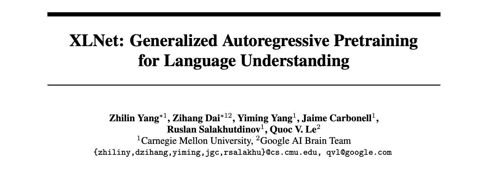
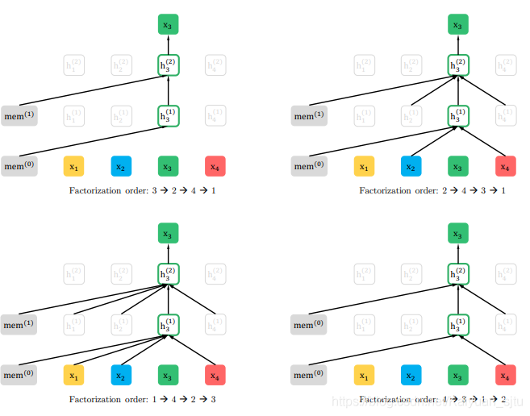
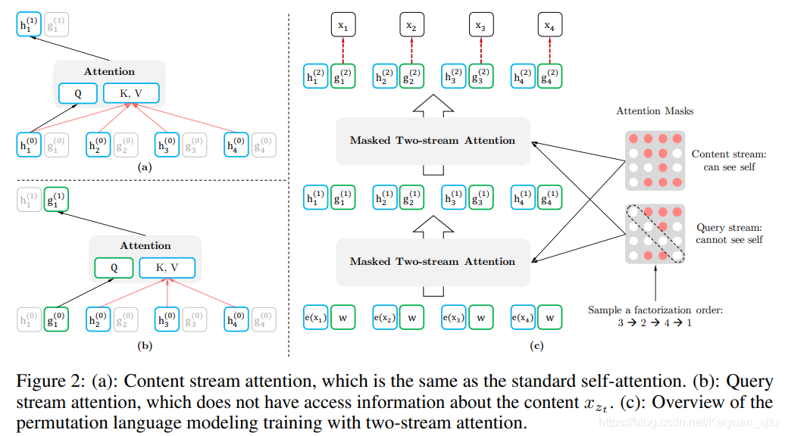
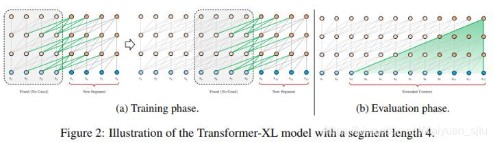

## XLNET

- 论文：XLNet: Generalized Autoregressive Pretraining for Language Understanding
- 地址：https://arxiv.org/pdf/1906.08237.pdf
- 源码：https://github.com/zihangdai/xlnet

可以看到，之前的预训练模型都是在 BERT 的基础上修改一些小组件，数据集啊预训练目标啊但是整体还是属于BERT派的。但是在这篇文章里，谷歌和 CMU 又放出了一个新的模型 XLNet，果然...又屠榜了...

首先数据和算力比 BERT 多是一个原因，另外一个的话也是找到了 BERT 中的一些缺点然后改进它导致的。

 PS. 关于 XLNet 的解读网上现在已经有很多了，所以这里我仅仅列举比较重要的几个方面，可能捎带几句不会太具体，这一节 reference 部分会给出个人认为比较好的解读参考~

### AE & AR

文章一开始就把大规模预训练模型分为两类 **autoregressive (AR)** 和 **autoencoding (AE)**。简单而言，自回归语言模型就是自左向右或者自右向左地对文本进行语言建模，它的好处是对生成任务有天然的优势，缺点呢就是只能得到单向的信息不能同时利用上下文的信息。而自编码就是类似 BERT 那样的通过 [MASK] 标记来获取前向和后向的信息。

### BERT的不足

文章主要指出了 BERT 模型的几点不足：

- 为了利用起上下文信息，BERT 引入的 [MASK] 标记会造成训练与预测阶段的不一致，出现 **pretrain-finetune discrepancy**，导致性能下降；
- BERT 假设随机 mask 掉的 token 是条件独立的，但是实际上它们之间可能存在关系

### XLNet的改进

为了改进上面 BERT 的缺陷，同时利用其 AR 和 AE 模型的优势，这就诞生了 XLNet。那么 XLNet 到底是怎么做的呢？

- **Permutation Language Modeling**

    为了不引入噪音的 [MASK] 标记，同时能够获取到上下文的信息。XLNet 新提出了一种预训练目标：**Permutation Language Modeling（PLM）**。对于长度为 T 的训练，输入 T 的所有可能的排列组合共 $T！$ 种（后面优化部分提出不会输入所有排列而是通过采样出一部分进行训练），但是整体的训练方向还是从左至右，这样处理就可以认为将上下文信息融入到模型当中去了。

    

- **Two-Stream Self-Attention**

    那么上述思想具体是怎么实现的呢？注意一下这里输入不同的排列组合不是真正地打乱原始输入，而是在网络结构内部进行一些操作让模型认为你的输入顺序改变了，因为我们在最后预测的时候输入是不会变的。这些操作就是通过**注意力掩码**来实现的，其实这个思想在之前的 **Unified Language Model Pre-training for Natural Language Understanding and Generation（Microsoft/2019）** 也有出现过。下面简单介绍一下具体的**双流注意力**

    **（1）content 流注意力：** 就是常见的 self-attention
    $$
    h_{z_{t}}^{(m)} \leftarrow \text { Attention }\left(\mathrm{Q}=h_{z_{t}}^{(m-1)}, \mathrm{KV}=\mathbf{h}_{\mathrm{z} \leq t}^{(m-1)} ; \theta\right)
    $$
    **（2）query 流注意力：** 主要就是用来解决 BERT 里的 [MASK] 标记的
    $$
    g_{z_{t}}^{(m)} \leftarrow \text { Attention }\left(\mathrm{Q}=g_{z_{t}}^{(m-1)}, \mathrm{KV}=\mathbf{h}_{\mathrm{z}<t}^{(m-1)} ; \theta\right)
    $$
    

- **Transformer-XL**

    做这一改进是支持长文本的任务

    

### reference

- [官方开源代码](https://github.com/zihangdai/xlnet)

- [XLNet:运行机制及和Bert的异同比较](https://zhuanlan.zhihu.com/p/70257427)

- [如何评价在20个任务上超越BERT的XLNet？](https://www.zhihu.com/question/330307904/answer/721986216)

- [【NLP】XLNet粗读](https://zhuanlan.zhihu.com/p/70218096)

- [XLNet原理浅析](https://zhuanlan.zhihu.com/p/70395238)

